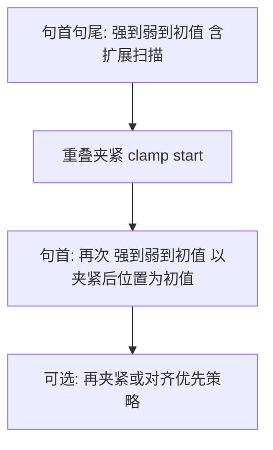

# 句边界块链与二次对齐方案（草案）

| 属性 | 说明 |
| --- | --- |
| 文档版本 | v1.0 |
| 状态 | **已实现**（[src/chunking/boundary.py](../../src/chunking/boundary.py)：`iter_boundary_aware_diag_rows`、`adjust_start_extended`、`_pipeline_start`） |
| 关联代码（现状） | [src/chunking/boundary.py](../../src/chunking/boundary.py) `iter_text_slices_boundary_aware` |
| 背景说明 | [句边界对齐切分.md](句边界对齐切分.md) |

---

## 1. 目标

- **禁止**在「无任何可接受断点」的情况下，用滑窗初值 `s0`/`e0` **直接**在连续汉字中间切断（即 `adjust_*` 退回初值、等价硬切的情形）。
- **句首/句尾**优先落在 **强句界**或**弱边界**之后（与现有 `BOUNDARY_CHARS`、`WEAK_BOUNDARY_CHARS` 一致）；重叠夹紧在可配置策略下**不得**长期压过可接受的边界语义。
- 在保持「强 → 弱 → 初值」框架的前提下，增加：**扩展扫描**、**夹紧后二次句首对齐**、以及冲突时的 **重叠 vs 句首** 优先级开关。

---

## 2. 根因（与实现对齐）

1. **±`max_probe`（默认 30）过窄**：长串汉字内无标点时，`adjust_end` / `adjust_start` 易 **return `e0`/`s0`**，等价硬切。
2. **重叠夹紧** `_clamp_start_to_overlap_range` 在句界对齐之后执行，可能把 `start` **推离**第一次对齐结果，造成句首落在上一句中间。**对策**：夹紧后**再**以新起点为初值做一次 **`adjust_start`（强→弱→初值）**。
3. **fallback**（`start >= end` 时回退 `(s0,e0)`）会重新引入未对齐硬切，应在扩展对齐与二次句首对齐之后再考虑回退。

---

## 3. 方案概览

**说明**：**句尾**仍按「先局部/扩展 `adjust_end`」在单窗内完成；**重叠只夹紧起点**，故「夹紧后再对齐」主要作用于 **句首**（`adjust_start`）。

---

## 4. 可接受断点（用于「不能乱切」的判定）

- **句尾合法**：右开终点 `e` 满足 `e == len(text)` 或 `text[e-1]` 属于 **`BOUNDARY_CHARS ∪ WEAK_BOUNDARY_CHARS`**。
- **句首合法**（`s > 0`）：`text[s-1]` 属于 **同上集合**（起点在断点之后）。

实现时可抽 `_is_acceptable_cut_after(text, index)`（表示在 `index` 之后切）避免重复。

---

## 5. 扩展扫描（解决「连续中文硬切」）

在现有 **强→弱→初值（±`max_probe`）** 之后增加**第二档**（建议仅当第一档结果**不合法**或**等价硬切**时触发，避免无谓全篇扫描）：

- **`adjust_end`**：若当前候选 `e` 不满足「句尾合法」，在 **`[e0 - max_boundary_scan, e0 + max_boundary_scan]`**（与全文长度裁剪）内，按与现逻辑一致的 **最小 `|Δ|`** 原则，在 **强界优先、再弱界** 的框架下寻找合法 `e`（搜索半径扩大到 `max_boundary_scan`）。
- **`adjust_start`**：对称：若 `s > 0` 且不满足句首合法，在 **`s0` 附近扩展窗口**内寻找合法 `s`。

**上界**：`max_boundary_scan` 建议默认 **`min(chunk_size, 某常数如 800)`** 或 **等于 `chunk_size`**，并做成配置项 **`CHUNK_BOUNDARY_MAX_SCAN`**，防止单窗扫描整篇。

**仍无解的极端情况**（整段无标点、无空格）：只能退避到文档末/初值并**记录**（或保留硬切），可在 `TextChunk.extra` 或日志中标记。

---

## 6. 重叠夹紧之后：再次「强→弱→初值」（核心）

**动机**：仅 `s_adj = clamp(s_aligned)` 时，夹紧可能把起点推到**非句界/非弱界**之后，出现「为了重叠而在连续汉字里切开」。**即使已经做了重叠夹紧，也应在夹紧结果上再跑一轮边界对齐**（以夹紧后位置为初值，而非回到 `s0`）。

**建议管线（句首）**：

1. `s_a = adjust_start(s0)`（可含扩展扫描，见第 5 节）。
2. `s_b = clamp(s_a, prev_end, floor, ceiling)`。
3. **`s_c = adjust_start(s_b)`** —— 以 **`s_b` 当作新的初值**再执行 **强→弱→初值**（探测范围仍用 `max_probe` / 扩展半径）；专门修复「夹紧破坏句首」的问题。
4. **重叠协调**（实现时定稿其一或做成配置）：
   - **4a** 以 **`s_c` 为最终起点**，接受其与上一块的实际重叠 **可能** 再次落在 `[floor, ceiling]` 外（**边界优先**）；
   - **4b** 对 **`s_c` 再执行一次 `clamp`**；若又回到坏句首，则 **4a 与 4b 二选一**或 **有限次循环**（如最多 2 轮 clamp↔adjust），避免死循环；
   - **4c** 若仍无法同时满足，则使用下节 **`boundary_priority_over_overlap`**：**保留**某一步的句首合法解并允许重叠违约。

**与「对齐优先、不夹紧」的区别**：本方案是 **先按重叠带夹紧，再修句首**，而不是一上来放弃夹紧；更符合「重叠与句界尽量两全」。

---

## 7. 可选：`CHUNK_BOUNDARY_PRIORITY_OVERLAP`（与第 6 节配合）

当 **clamp↔adjust** 有限次迭代仍无法同时满足 **句首合法** 与 **重叠区间** 时，用开关决定 **最终牺牲哪一端**：

| 取值 | 含义 |
| --- | --- |
| `False`（默认） | 优先满足 **重叠区间**（与当前产品更接近）；句首应已通过第 6 节尽量缓解。 |
| `True` | 优先 **句首合法**，**允许**实际重叠落在 `[floor, ceiling]` **之外**。 |

**注意**：违约重叠会影响检索与向量块重叠统计，需在 `.env.example` 与 [句边界对齐切分.md](句边界对齐切分.md) 中写明副作用。

---

## 8. Fallback 链调整

当 **`s_adj >= e_adj`** 时，**不要立刻**回退到原始 `(s0, e0)`；应：

1. 对当前窗再尝试 **扩展扫描** 后的 `adjust_*` 与 `e_adj = min(s_adj + chunk_size, n)` 等修复；
2. 仍无效再回退，且回退后同样可做一次 **扩展扫描**（避免回退再次硬切）。

---

## 9. 配置与接入（建议）

| 配置项 | 含义 |
| --- | --- |
| `CHUNK_BOUNDARY_MAX_SCAN` | 扩展扫描半径（字符），默认可与 `chunk_size` 挂钩 |
| `CHUNK_BOUNDARY_PRIORITY_OVERLAP` | 冲突时是否句首合法优先于重叠带（与第 7 节配合） |
| `CHUNK_BOUNDARY_CLAMP_ADJUST_MAX_ROUNDS`（可选） | clamp 与 `adjust_start` 最大往返次数，默认 1 或 2，防死循环 |
| 现有 `max_probe` | 第一档局部探测，与扩展扫描分层 |

接入点：`conf.get_settings()` → `iter_text_slices_boundary_aware` / `iter_chunks_for_text`；预览 Web `POST /api/preview` 在 `boundary_aware` 时可沿用 settings（与现有 `overlap_floor` / `overlap_ceiling` 一致）。

---

## 10. 测试与文档（落地时）

- **单元测试**：`tests/test_chunking/test_boundary.py` — 长无标点后紧跟句号、clamp 破坏句首、`boundary_priority_over_overlap=True` 等。
- **脚本**：`scripts/analyze_boundary_chunk_integrity.py` 的 `_diag_windows` 与线上一致，避免统计分叉。
- **主文档**：将「扩展扫描」「夹紧后二次句首对齐」「重叠冲突优先级」并入 [句边界对齐切分.md](句边界对齐切分.md)（实现后把本草案状态改为「已实现」并交叉引用）。

---

## 11. 风险与权衡

- **块长波动**：扩展扫描可能使单块明显短于或长于 `chunk_size`。
- **重叠违约**：第 6 节选 **4a** 或第 7 节为 `True` 时，检索侧需容忍实际重叠超出原 band。
- **clamp↔adjust 往返**：二次 `adjust_start` 可能使重叠再次越界，需明确是否第二轮 clamp 及终止条件，避免振荡。
- **性能**：每块最坏扫描 `O(max_boundary_scan)`，默认与 `chunk_size` 同量级，通常可接受。

---

## 12. 修订记录

| 日期 | 说明 |
| --- | --- |
| 2026-04 | 草案：扩展扫描、夹紧后二次句首对齐、重叠冲突开关；自内部计划整理入 `doc/chunk` |
| 2026-04 | 落地：`CHUNK_BOUNDARY_*` 配置、`_effective_max_boundary_scan`、分析脚本与单测 |
