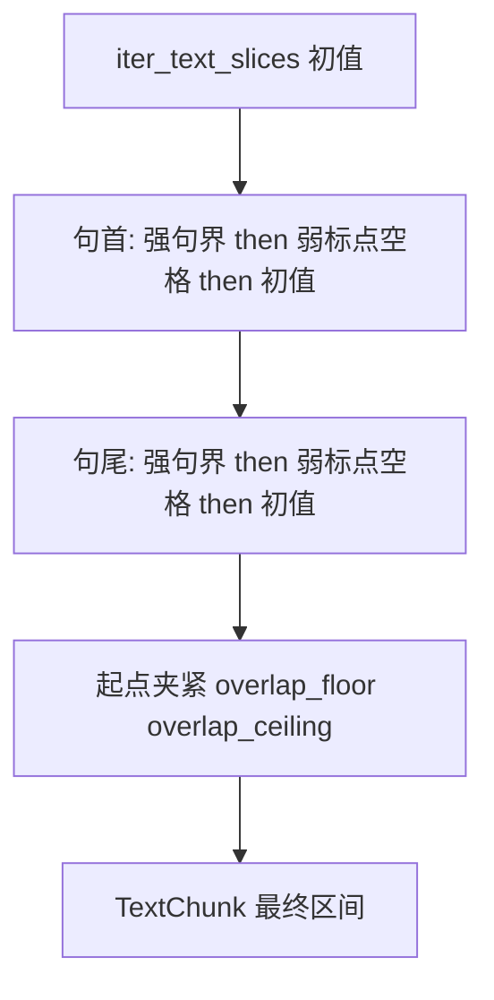

# 句边界对齐切分

| 属性 | 说明 |
| --- | --- |
| 文档版本 | 修订版 |
| 状态 | **已实现**（[src/chunking/boundary.py](../../src/chunking/boundary.py)，`iter_chunks_for_text(..., boundary_aware=True)`） |
| 关联代码 | [src/chunking/split.py](../../src/chunking/split.py)、[src/chunking/boundary.py](../../src/chunking/boundary.py) |
| 相关文档 | [Chunking 切分效果人工测试v01.md](Chunking%20切分效果人工测试v01.md) |

---

## 1. 目标与现状

- **现状**：`iter_text_slices` 为**纯字符滑窗**，步长 `chunk_size - chunk_overlap`，容易在句中截断。
- **目标**：仍以 **chunk_size、chunk_overlap**（如 1500 / 100，或来自配置）生成**初值区间** `[start, end)`，再对**句首（`start`）**与**句尾（`end`）**做**三层对齐**：强句界 → 弱标点/空格 → 保持该侧初值（滑窗固定切分）。

---

## 2. 强句界截止符号（五种）

以下字符均视为**强句/读段截止**（实现为 `BOUNDARY_CHARS`）：

- 中文标点：**`。` `！` `？` `；`**
- **换行**：**`\n`**；另含 **`\r`**，便于在不改动字符串长度的情况下识别 Windows 换行。

不包含英文句号 `.`，除非日后单独扩展。

---

## 3. 弱边界（无强句界时）

在 ±`max_probe` 内**若强句界无候选**（两侧均找不到 `BOUNDARY_CHARS`），则在**同一窗口**内找「离初值最近」的 **弱边界字符**（实现为 `WEAK_BOUNDARY_CHARS`）：常见中英文标点、括号、空格、制表等；**起点/右开终点**在弱字符**之后**（与强句界一致）。**平局**：`|Δ|` 相同时**优先向后**（更小下标）。若仍无弱边界，则**保持该侧初值 `s0`/`e0`**。

---

## 4. 最大探测长度

- **`max_probe = 30`（字符数）**：从初值 `start` / `end` 向两侧探测时，**单侧**最多覆盖 30 个字符位置（含与初值相邻的位置）。实现中为常量 **`DEFAULT_MAX_PROBE`**，可在 `iter_text_slices_boundary_aware(..., max_probe=...)` 中覆盖（供测试）。
- 强句界与弱边界均受此窗口限制。

---

## 5. 句首（`start`）双向探测，取最小位移

记初值为 `s0`。**仅强句界**（本节描述同实现 `adjust_start` 内 `_align_start_strong`）：在 `[max(0, s0 - 30), s0)` 与 `[s0, min(len(text), s0 + 30))` 内自右向左 / 自左向右找**第一个**强截止符，候选新起点为截止符之后；**`|Δ|` 较小**者优先；平局**优先向后**；两侧无强句界则进入弱边界（见第 3 节），再无则 **`s0`**。

**边界**：`s0 == 0` 时，无向后区间；仅向前探测或保持 `0`。

---

## 6. 句尾（`end`，右开区间）双向探测，取最小位移

记初值为 `e0`。**仅强句界**（`_align_end_strong`）与句首对称；无强则弱（`_align_end_weak`），再无则 **`e0`**。`**e0 == len(text)`** 时保持 **`len(text)`**。

---

## 7. 与滑窗、块链的关系

1. **流程**：先 `iter_text_slices` 得到多段初值 `(s0, e0)`。
2. **每段内**：先调 `start`（强→弱→初值），再调 `end`（强→弱→初值）。
3. **块间约束（重叠区间）**：滑窗目标重叠为 `chunk_overlap`（步长 `chunk_size - chunk_overlap`）。记上一块右开终点为 `prev_end`，则本块与上一块的**重叠** `L = prev_end - start` 需满足 **`overlap_floor <= L <= overlap_ceiling`**（配置：`CHUNK_OVERLAP_MIN` / `CHUNK_OVERLAP_MAX`，代码默认未设时均等于 `chunk_overlap`）。等价于 **`prev_end - overlap_ceiling <= start <= prev_end - overlap_floor`**，在句界对齐得到 `s_adj` 后取 **`min(max(s_adj, prev_end - overlap_ceiling), prev_end - overlap_floor)`**。若误用 **`max(...)`** 作下界，会把起点强行右推，导致块首落在句中（如「的统一领导下…」）。当 `overlap_floor < chunk_overlap < overlap_ceiling` 时，实际重叠可在 `[overlap_floor, overlap_ceiling]` 内浮动（如 40～160）。
4. **块长与重叠**：对齐后实际块长可能偏离 `chunk_size`；实际重叠受 `overlap_floor`/`overlap_ceiling`、句界与 `max_probe` 共同约束。
5. **异常**：若调整后仍 `start >= end`，回退到该段初值 `(s0, e0)` 并再次施加块链约束；若仍无效，将 `end` 扩展为至少 `start + 1` 或跳过（见实现）。
6. **实现注意**：若某窗在修正后 `start >= len(text)`，应**跳过该窗并继续处理后续滑窗**（`continue`），不得提前终止整个迭代，否则长文本会表现为块数锐减或尾部丢失。

---

## 8. 设计取舍说明

- **五种截止符**比仅用 `。！？` 更贴合法条；**`；`** 过密可能导致块偏短。
- **双向取最小 `|Δ|`** 在短探针（30）下可减少单侧过度拉扯。
- **`max_probe = 30`** 较小时，长句仍可能在句中切断，属刻意权衡。

---

## 9. 实现与调用（已完成）

| 项目 | 说明 |
| --- | --- |
| 模块 | [boundary.py](../../src/chunking/boundary.py)：`adjust_start`、`adjust_end`、`iter_text_slices_boundary_aware` |
| 接入 | [split.py](../../src/chunking/split.py)：`iter_chunks_for_text`、`iter_file_chunks`、`iter_chunks_for_data_dir`、`load_all_chunks` 均支持 **`boundary_aware: bool = False`** |
| 预览 Web | `POST /api/preview` 的 JSON 字段 **`boundary_aware`**；multipart 中 **`boundary_aware=true`**；响应 `summary.boundary_aware` |
| 单测 | [tests/test_chunking/test_boundary.py](../../tests/test_chunking/test_boundary.py) |

---

## 10. 流程示意

---

## 11. 风险与注意事项

- **`；` 过密**可能导致块偏短。
- **换行**：Markdown 中空行多为 `\n\n`，可能产生较短段。
- **默认**：`boundary_aware=False`，与既有纯滑窗行为兼容。

---

## 12. 修订记录

| 版本 | 日期 | 说明 |
| --- | --- | --- |
| 修订版 | 2026-04 | 五种截止符、双向 min 位移、`max_probe=30`、块链协调 |
| 实现 | 2026-04 | 落地 `boundary.py`、API 与单测、本表更新为「已实现」 |
| 2026-04 | 弱边界、重叠区间 `[CHUNK_OVERLAP_MIN, CHUNK_OVERLAP_MAX]`、`CHUNK_OVERLAP_MAX` 配置 |
