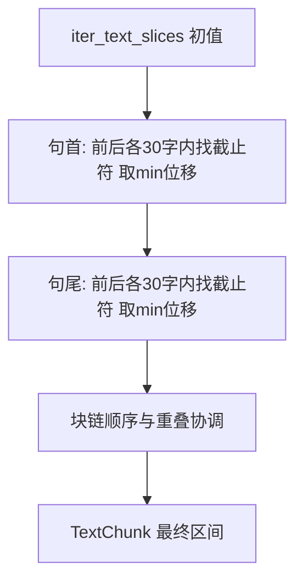

# 句边界对齐切分

| 属性 | 说明 |
| --- | --- |
| 文档版本 | 修订版（与 Cursor 计划「句边界切分增强」对齐） |
| 状态 | 设计规格（实现见后续 PR） |
| 关联代码 | [src/chunking/split.py](../../src/chunking/split.py)（`iter_text_slices` 纯滑窗） |
| 相关文档 | [Chunking 切分效果人工测试v01.md](Chunking%20切分效果人工测试v01.md) |

---

## 1. 目标与现状

- **现状**：`iter_text_slices` 为**纯字符滑窗**，步长 `chunk_size - chunk_overlap`，容易在句中截断。
- **目标**：仍以 **chunk_size、chunk_overlap**（如 1500 / 100，或来自配置）生成**初值区间** `[start, end)`，再对**句首（`start`）**与**句尾（`end`）**分别做边界对齐；**对齐失败则保持该侧初值**。

---

## 2. 截止符号（五种）

以下字符均视为**句/读段截止**（实现中可用常量集合表示）：

- 中文标点：**`。` `！` `？` `；`**
- **换行**：建议以 **`\n`** 作为截止。若需兼容 Windows，可在扫描前将 `\r\n` 归一为 `\n`，或把 `\r` 与 `\n` 一并视为换行截止，**实现时二选一并在注释中写死**。

不包含英文句号 `.`，除非日后单独扩展。

---

## 3. 最大探测长度

- **`max_probe = 30`（字符数）**：从初值 `start` / `end` 向两侧探测时，**单侧**最多覆盖 30 个字符位置（含与初值相邻的位置）。
- 若在「向前、向后」两个方向的探测范围内**都未能**找到可用于对齐的截止符，则**该边界保持滑窗初值不变**。

---

## 4. 句首（`start`）双向探测，取最小位移

记初值为 `s0`。

- **向后（下标减小）**：在区间 `[max(0, s0 - 30), s0)` 内自右向左找**最后一个**属于截止集合的字符，下标记为 `k`。若找到，候选新起点 **`s_back = k + 1`**（句首落在截止符之后）。位移 **`Δ_back = s_back - s0`**（通常为负或 0）。
- **向前（下标增大）**：在区间 `[s0, min(len(text), s0 + 30))` 内自左向右找**第一个**截止符，下标记为 `m`。若找到，候选新起点 **`s_fwd = m + 1`**。位移 **`Δ_fwd = s_fwd - s0`**（通常为正或 0）。
- **选择规则**：在「向后、向前」两个**有效候选**（在 30 字内确实找到截止符）中，取 **`|Δ|` 较小**的一方作为新 `start`。若仅一侧有效，用该侧。若两侧均无效，**`start = s0`**。
- **平局**：若 `|Δ_back| == |Δ_fwd|`，须固定一种**平局策略**（例如优先向后，更贴近「补全句首」；或优先向前，减少与上一块重叠）。实现时选一种并写进注释与单测。

**边界**：`s0 == 0` 时，无向后区间；仅向前探测或保持 `0`。

---

## 5. 句尾（`end`，右开区间）双向探测，取最小位移

记初值为 `e0`（`text[e0]` 为下一块首字，或已到文末则 `e0 = len(text)`）。

目标：让块的**右开终点**落在「截止符之后」或文末，与句首对称。

- **向后**：在 `[max(0, e0 - 30), e0 - 1]` 内自右向左找**最后一个**截止符 `k`，候选 **`e_back = k + 1`**（与 Python 切片一致：块包含 `text[k]`）。位移 **`e_back - e0`**。
- **向前**：在 `[e0, min(len(text), e0 + 30))` 内自左向右找**第一个**截止符 `m`，候选 **`e_fwd = m + 1`**。
- 同样取 **`|Δ|` 最小**的有效候选；两侧均无效则 **`end = e0`**。
- **`e0 == len(text)`**：已到文末，保持 **`len(text)`**，不再向前探。

实现时需用**小例子**在单测中固定「句尾」语义，避免 off-by-one。

---

## 6. 与滑窗、块链的关系

1. **流程**：先 `iter_text_slices` 得到多段初值 `(s0, e0)`。
2. **每段内**：建议先调 `start`，再调 `end`（顺序需实现内统一并写死）。
3. **块间约束**：调整后可能与下一段重叠关系异常，需**顺序协调**（例如保证 `start_{i+1}` 与上一段 `end_i` 满足目标重叠 `chunk_overlap`，必要时裁剪或二次收缩）。
4. **块长与重叠**：对齐后实际块长可能偏离 `chunk_size`，重叠也可能略偏离 `chunk_overlap`，文档与产品说明中归为「目标窗口 + 句界修正」。

---

## 7. 设计取舍说明

- **五种截止符**比仅用 `。！？` 更贴合法条（分号、换行常表示条款/换段）；但 **`；`** 可能在一句内多次出现，块可能偏短。若上线后过碎，可再收紧规则（与产品迭代）。
- **双向取最小 `|Δ|`** 在短探针（30）下可减少单侧过度拉扯。
- **`max_probe = 30`** 较小时，长句仍可能在句中切断，属刻意权衡：**宁可偶尔切断，也不把单块拖到极长**。

---

## 8. 实现计划（供开发）

| 步骤 | 内容 |
| --- | --- |
| 1 | 常量 `BOUNDARY_CHARS` 与换行处理；实现 `adjust_start(text, s0, max_probe=30)`、`adjust_end(text, e0, max_probe=30)`，内含双向候选、min `|Δ|`、平局策略。 |
| 2 | `iter_text_slices_boundary_aware(...)`（名称可定）：包装原滑窗，逐段 `adjust`，再接块链协调。 |
| 3 | `iter_chunks_for_text` 等增加布尔或枚举参数；**默认**建议仍用纯滑窗，句感知策略须**显式开启**，避免静默改变行为。 |
| 4 | [src/chunking/webui/](../../src/chunking/webui/) 预览页可增加开关或按产品选择默认策略。 |
| 5 | 单测：双向竞争选较小位移；30 内无标点则保持初值；`；` 与 `\n`；首块/末块；块链不交叉。 |
| 6 | 同步更新 [v1.0.1-chunking-plan.md](../plan/v1.0.1-chunking-plan.md) 或 [Chunking 切分效果人工测试v01.md](Chunking%20切分效果人工测试v01.md) 中的切分规则一句。 |

---

## 9. 流程示意

---

## 10. 风险与注意事项

- **`；` 过密**可能导致块偏短；可用数据观察后再调权或从集合中移除。
- **换行**：Markdown 中空行多为 `\n\n`，可能在行首/行尾产生很短的段，需单测覆盖。
- **平局与链式协调**需在实现与测试中固定规则，避免行为不确定。

---

## 11. 修订记录

| 版本 | 日期 | 说明 |
| --- | --- | --- |
| 修订版 | 2026-04 | 五种截止符、双向 min 位移、`max_probe=30`、块链协调；由 Cursor 计划整理入库。 |
