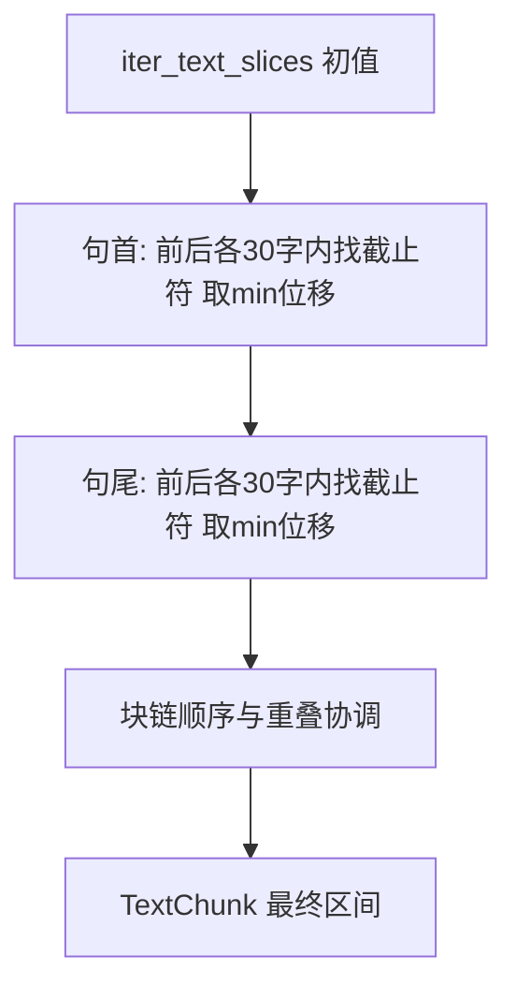

# 句边界对齐切分

| 属性 | 说明 |
| --- | --- |
| 文档版本 | 修订版 |
| 状态 | **已实现**（[src/chunking/boundary.py](../../src/chunking/boundary.py)，`iter_chunks_for_text(..., boundary_aware=True)`） |
| 关联代码 | [src/chunking/split.py](../../src/chunking/split.py)、[src/chunking/boundary.py](../../src/chunking/boundary.py) |
| 相关文档 | [Chunking 切分效果人工测试v01.md](Chunking%20切分效果人工测试v01.md) |

---

## 1. 目标与现状

- **现状**：`iter_text_slices` 为**纯字符滑窗**，步长 `chunk_size - chunk_overlap`，容易在句中截断。
- **目标**：仍以 **chunk_size、chunk_overlap**（如 1500 / 100，或来自配置）生成**初值区间** `[start, end)`，再对**句首（`start`）**与**句尾（`end`）**分别做边界对齐；**对齐失败则保持该侧初值**。

---

## 2. 截止符号（五种）

以下字符均视为**句/读段截止**（实现为 `BOUNDARY_CHARS`）：

- 中文标点：**`。` `！` `？` `；`**
- **换行**：**`\n`**；另含 **`\r`**，便于在不改动字符串长度的情况下识别 Windows 换行。

不包含英文句号 `.`，除非日后单独扩展。

---

## 3. 最大探测长度

- **`max_probe = 30`（字符数）**：从初值 `start` / `end` 向两侧探测时，**单侧**最多覆盖 30 个字符位置（含与初值相邻的位置）。实现中为常量 **`DEFAULT_MAX_PROBE`**，可在 `iter_text_slices_boundary_aware(..., max_probe=...)` 中覆盖（供测试）。
- 若在「向前、向后」两个方向的探测范围内**都未能**找到可用于对齐的截止符，则**该边界保持滑窗初值不变**。

---

## 4. 句首（`start`）双向探测，取最小位移

记初值为 `s0`。

- **向后（下标减小）**：在区间 `[max(0, s0 - 30), s0)` 内自右向左找**最后一个**属于截止集合的字符，下标记为 `k`。若找到，候选新起点 **`s_back = k + 1`**（句首落在截止符之后）。位移 **`Δ_back = s_back - s0`**（通常为负或 0）。
- **向前（下标增大）**：在区间 `[s0, min(len(text), s0 + 30))` 内自左向右找**第一个**截止符，下标记为 `m`。若找到，候选新起点 **`s_fwd = m + 1`**。位移 **`Δ_fwd = s_fwd - s0`**（通常为正或 0）。
- **选择规则**：在「向后、向前」两个**有效候选**（在 30 字内确实找到截止符）中，取 **`|Δ|` 较小**的一方作为新 `start`。若仅一侧有效，用该侧。若两侧均无效，**`start = s0`**。
- **平局**：若 `|Δ_back| == |Δ_fwd|`，**优先向后**候选（`s_back`）。

**边界**：`s0 == 0` 时，无向后区间；仅向前探测或保持 `0`。

---

## 5. 句尾（`end`，右开区间）双向探测，取最小位移

记初值为 `e0`（`text[e0]` 为下一块首字，或已到文末则 `e0 = len(text)`）。

目标：让块的**右开终点**落在「截止符之后」或文末，与句首对称。

- **向后**：在 `[max(0, e0 - 30), e0 - 1]` 内自右向左找**最后一个**截止符 `k`，候选 **`e_back = k + 1`**（与 Python 切片一致：块包含 `text[k]`）。位移 **`e_back - e0`**。
- **向前**：在 `[e0, min(len(text), e0 + 30))` 内自左向右找**第一个**截止符 `m`，候选 **`e_fwd = m + 1`**。
- 同样取 **`|Δ|` 最小**的有效候选；两侧均无效则 **`end = e0`**；平局**优先向后**。
- **`e0 == len(text)`**：已到文末，保持 **`len(text)`**，不再向前探。

---

## 6. 与滑窗、块链的关系

1. **流程**：先 `iter_text_slices` 得到多段初值 `(s0, e0)`。
2. **每段内**：先调 `start`，再调 `end`。
3. **块间约束（与上一块重叠至少 `chunk_overlap` 字）**：记上一块右开终点为 `prev_end`，则本块起点需满足 `prev_end - start >= chunk_overlap`，即 **`start <= prev_end - chunk_overlap`**。在句界对齐得到 `s_adj` 后应取 **`min(s_adj, prev_end - chunk_overlap)`**（并与 `>= 0` 协调）。若误用 **`max(s_adj, prev_end - chunk_overlap)`**，会把起点强行右推，导致块首落在句中（如「的统一领导下…」）。
4. **块长与重叠**：对齐后实际块长可能偏离 `chunk_size`，重叠也可能略偏离 `chunk_overlap`。
5. **异常**：若调整后仍 `start >= end`，回退到该段初值 `(s0, e0)` 并再次施加块链约束；若仍无效，将 `end` 扩展为至少 `start + 1` 或跳过（见实现）。
6. **实现注意**：若某窗在修正后 `start >= len(text)`，应**跳过该窗并继续处理后续滑窗**（`continue`），不得提前终止整个迭代，否则长文本会表现为块数锐减或尾部丢失。

---

## 7. 设计取舍说明

- **五种截止符**比仅用 `。！？` 更贴合法条；**`；`** 过密可能导致块偏短。
- **双向取最小 `|Δ|`** 在短探针（30）下可减少单侧过度拉扯。
- **`max_probe = 30`** 较小时，长句仍可能在句中切断，属刻意权衡。

---

## 8. 实现与调用（已完成）

| 项目 | 说明 |
| --- | --- |
| 模块 | [boundary.py](../../src/chunking/boundary.py)：`adjust_start`、`adjust_end`、`iter_text_slices_boundary_aware` |
| 接入 | [split.py](../../src/chunking/split.py)：`iter_chunks_for_text`、`iter_file_chunks`、`iter_chunks_for_data_dir`、`load_all_chunks` 均支持 **`boundary_aware: bool = False`** |
| 预览 Web | `POST /api/preview` 的 JSON 字段 **`boundary_aware`**；multipart 中 **`boundary_aware=true`**；响应 `summary.boundary_aware` |
| 单测 | [tests/test_chunking/test_boundary.py](../../tests/test_chunking/test_boundary.py) |

---

## 9. 流程示意

---

## 10. 风险与注意事项

- **`；` 过密**可能导致块偏短。
- **换行**：Markdown 中空行多为 `\n\n`，可能产生较短段。
- **默认**：`boundary_aware=False`，与既有纯滑窗行为兼容。

---

## 11. 修订记录

| 版本 | 日期 | 说明 |
| --- | --- | --- |
| 修订版 | 2026-04 | 五种截止符、双向 min 位移、`max_probe=30`、块链协调 |
| 实现 | 2026-04 | 落地 `boundary.py`、API 与单测、本表更新为「已实现」 |
