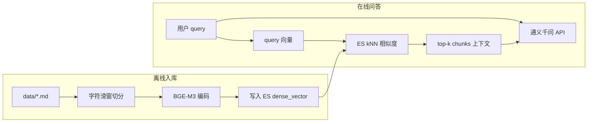

# 法律类 RAG MVP 技术方案与实施计划

| 属性 | 说明 |
| --- | --- |
| 文档版本 | v1.0.0 |
| 状态 | 计划基线 |
| 适用范围 | 仓库 `rag_law` 首个可运行 MVP（切分 → 向量 → ES → 检索 → LLM） |

---

## 1. 目标与范围

在现有空壳项目上实现闭环：**读取 `data/` 下 Markdown → 字符滑窗切分 → BGE-M3 向量化 → 写入 Elasticsearch kNN 索引 → 用户问题向量化 → 相似度检索 → 将命中 chunk 作为上下文调用兼容 OpenAI 的 LLM API 生成答案**。

**不在 MVP 内**：MySQL / Redis / Milvus、重排序模型、父子块层次检索、复杂查询路由等（可预留配置键）。

---

## 2. 现状摘要

- **代码**：`main.py` 仅占位，`pyproject.toml` 无依赖，需从零搭建流水线。
- **语料**：`data/` 下为多部法律的 `.md` 文件（如 `data/宪法.md`）。MVP 采用「按字符切分 + 重叠」；后续可升级为按「条/款」或标题层级切分，以提高法条边界完整性。
- **配置**：`.env` 中已有 `MODEL_*`、`ES_*`、`BGE_M3_PATH` 及 `CHUNK_*` / `RETRIEVAL_*`。

**说明**：

- `MYSQL_*`、`REDIS_*`、`MILVUS_*`，以及 `BGE_RERANKER_PATH`、`BERT_BASE_PATH`、`DOCUMENT_SEGMENTATION_PATH` 对「仅 ES + 字符切分」的 MVP **不必使用**。
- `PARENT_CHUNK_SIZE` / `CHILD_CHUNK_SIZE` 面向父子块/层次检索，与当前「单层字符块」不一致；建议 MVP 使用单一组 **`CHUNK_SIZE` + `CHUNK_OVERLAP`**（若已有 `CHUNK_OVERLAP=50`，可补 `CHUNK_SIZE` 或在文档中明确复用某个现有变量含义）。

**安全**：`.env` 含密钥与密码，勿提交入库；提供不含密钥的 `.env.example` 供协作（`.gitignore` 已忽略 `.env`）。生产密钥建议定期轮换。

---

## 3. 架构（MVP）

---

## 4. 技术栈建议

| 环节 | 选型 | 说明 |
| --- | --- | --- |
| 切分 | 字符数 + 重叠 | MVP 足够；重叠建议大于 0。后续可在换行/句号处优先断开，减少半句截断。 |
| 向量 | BGE-M3 | 与 ES kNN 兼容。本地路径用 `BGE_M3_PATH`；可用 FlagEmbedding 的 `BGEM3FlagModel` 或 `sentence-transformers` 加载 `BAAI/bge-m3`。向量维度以实际 `encode` 输出为准（dense 常见为 1024），并在 ES mapping 中写死 `dims`。 |
| 向量库 | Elasticsearch 9.3.2（Docker） | `dense_vector` + `knn` 为推荐用法，不改变本计划的索引与查询形态。详见第 5 节。MVP 可不建 MySQL/Redis。 |
| LLM | DashScope 兼容 OpenAI 的 `base_url` + 模型名（如 `qwen-plus`） | 使用 OpenAI 兼容客户端调用 `chat.completions`，便于仅通过环境变量更换模型。 |

**Milvus**：仅在数据量极大或向量与全文分集群部署时再考虑；当前规模单 ES 索引即可。

---

## 5. Elasticsearch 版本说明（9.3.2）

镜像：`docker.elastic.co/elasticsearch/elasticsearch:9.3.2`

- **对整体方案**：**无本质影响**。仍采用 `dense_vector` + `knn` 做近似最近邻；向量维度、归一化策略、入库与检索流程与 8.x 场景一致。
- **实现时注意**：
  - **Python 客户端**：在 `pyproject.toml` 中锁定与 **Server 9** 兼容的 `elasticsearch` 包版本（以官方兼容性为准）；首次联调需跑通 `indices.create`、`bulk`、`search`（含 `knn`）。
  - **安全与连接**：若启用 HTTPS / 基本认证，在 `.env` 中配置 `ES_USER`、`ES_PASSWORD`、`ES_USE_SSL` 等（见第 7 节「可选补充」）。
  - **API 细节**：若 9.x 对 `knn` 参数有弃用或调整，以集群返回提示为准；核心仍是「向量字段名 + `query_vector` + `k`」。

---

## 6. Elasticsearch 索引设计要点

- **索引名**：使用环境变量，如 `ES_INDEX=rag_law_doc_chunks`（命名约定见 [v1.0.3-es-store-plan.md](v1.0.3-es-store-plan.md)），避免写死在代码中。
- **Mapping 建议**：
  - `text`：`text` 类型（可选：IK `ik_smart`；MVP 可仅靠向量检索）。
  - `embedding`：`dense_vector`，`dims` 与模型一致，`index: true`，`similarity` 与编码时是否 L2 归一化一致（`cosine` 或 `dot_product`）。
  - 元数据：`source_file`、`chunk_index`、`char_start` / `char_end`（便于调试与引用）。
- **查询**：对 `embedding` 做 `knn`，`k` 取自 `RETRIEVAL_K`；如需按文件过滤，增加 `filter`。

---

## 7. 配置项：MVP 建议清单

**建议直接使用**

- `MODEL_API_KEY`、`MODEL_BASE_URL`、`MODEL_NAME`
- `ES_HOST`、`ES_PORT`、`ES_INDEX`（建议新增）
- `BGE_M3_PATH`
- `CHUNK_OVERLAP`；补充 `CHUNK_SIZE`（或文档化单一变量含义）
- `RETRIEVAL_K`

**MVP 可不接入（代码可不读）**

- `MYSQL_*`、`REDIS_*`、`MILVUS_*`
- `BGE_RERANKER_PATH`、`BERT_BASE_PATH`、`DOCUMENT_SEGMENTATION_PATH`
- `VALID_SOURCES`（除非实现 API 层数据源校验）
- `CANDIDATE_M`（无 rerank 时可忽略，避免误解）

**可选补充**

- `ES_USER` / `ES_PASSWORD` / `ES_USE_SSL`
- `EMBEDDING_BATCH_SIZE`（批编码，减轻 OOM）

---

## 8. 代码与目录（建议）

- 模块示例：`chunking.py`、`embeddings.py`、`es_store.py`、`ingest` / `qa` 流水线、`config.py`（`pydantic-settings` 或 `python-dotenv`）。
- 包布局：`src/rag_law/` 或仓库根平铺模块，与 `pyproject.toml` 的 packages 配置一致即可。
- CLI：`python -m rag_law.ingest` 扫描 `data/`，`python -m rag_law.qa "问题"`，后续可接 FastAPI。

**依赖（示例）**：`elasticsearch`（与 ES 9.3.2 兼容）、`openai`、`python-dotenv`，以及 `FlagEmbedding` 或 `sentence-transformers` + `torch`（按 CPU/GPU 环境选择）。

---

## 9. 实施顺序

完成某项后，可将 `- [ ]` 改为 `- [x]` 表示已勾选。

- [x] **配置层**：读取 `.env`；提供 `.env.example`；统一 chunk / ES / 模型参数命名。
- [x] **切分**：遍历 `data/*.md`，UTF-8 读取，按 `CHUNK_SIZE` / `CHUNK_OVERLAP` 生成块并附元数据。
- [x] **向量**：加载本地 BGE-M3，封装 `embed_documents` / `embed_query`（见 [`v1.0.2-bge-m3-embedding-plan.md`](v1.0.2-bge-m3-embedding-plan.md)）；稠密向量 **L2 归一化** 后与 ES `dense_vector` + **`cosine`** 一致。
- [x] **ES**：创建索引 mapping；bulk 写入；`search(query_vector, k)`（见 [`v1.0.3-es-store-plan.md`](v1.0.3-es-store-plan.md)、[`src/es_store`](../../src/es_store/)）。
- [x] **入库**：端到端跑通（MVP 可每次全量重建索引）。实施方案与命令见 [`v1.0.4-ingest-plan.md`](v1.0.4-ingest-plan.md)（[`scripts/rag_ingest.py`](../../scripts/rag_ingest.py)）。
- [ ] **问答**：拼接 system/user 提示（引用依据、无法律依据时声明）；调用兼容接口返回答案。开发前可先验证 `MODEL_*` 连通性：[`scripts/llm_smoke_test.py`](../../scripts/llm_smoke_test.py)（`uv sync --extra llm`，见 [`README.md`](../../README.md)）。
- [ ] **验收**：1～2 个法律问题，检查检索 chunk 与答案是否贴合条文。

---

## 10. 任务清单（与实现对应）

| 序号 | 任务 | 说明 |
| --- | --- | --- |
| 1 | 配置与 `.env.example` | 含 `ES_INDEX`、`CHUNK_SIZE` 等 MVP 键 |
| 2 | 切分 + 向量 | 扫描 `data`、字符滑窗、BGE-M3 封装 |
| 3 | ES 索引与检索 | mapping、bulk、kNN（见 [`v1.0.3-es-store-plan.md`](v1.0.3-es-store-plan.md)） |
| 4 | 入库 CLI | 可全量重建（见 [`v1.0.4-ingest-plan.md`](v1.0.4-ingest-plan.md)） |
| 5 | 问答 | query 向量化 + 检索 + prompt + LLM |

---

## 11. 后续扩展（非 MVP）

- 检索：`bge-reranker` 对 top-`CANDIDATE_M` 重排。
- 切分：按「第 n 条」或 Markdown 标题；父子块与 `PARENT_CHUNK_SIZE` / `CHILD_CHUNK_SIZE`。
- 元数据：MySQL 存文档版本、生效日期；ES 存向量与 chunk。

---

## 12. 版本记录

| 版本 | 日期 | 说明 |
| --- | --- | --- |
| v1.0.0 | 2026-04-05 | 首版计划基线：MVP 范围、ES 9.3.2、配置与实施顺序；计划文档命名为 `v{semver}-rag-law-mvp-plan.md` 便于按版本排序 |
| v1.0.0 修订 | 2026-04 | §9「入库」勾选完成：见 [`v1.0.4-ingest-plan.md`](v1.0.4-ingest-plan.md)、[`scripts/rag_ingest.py`](../../scripts/rag_ingest.py) |

后续修订请递增版本号（如 v1.1.0）并更新本节。
