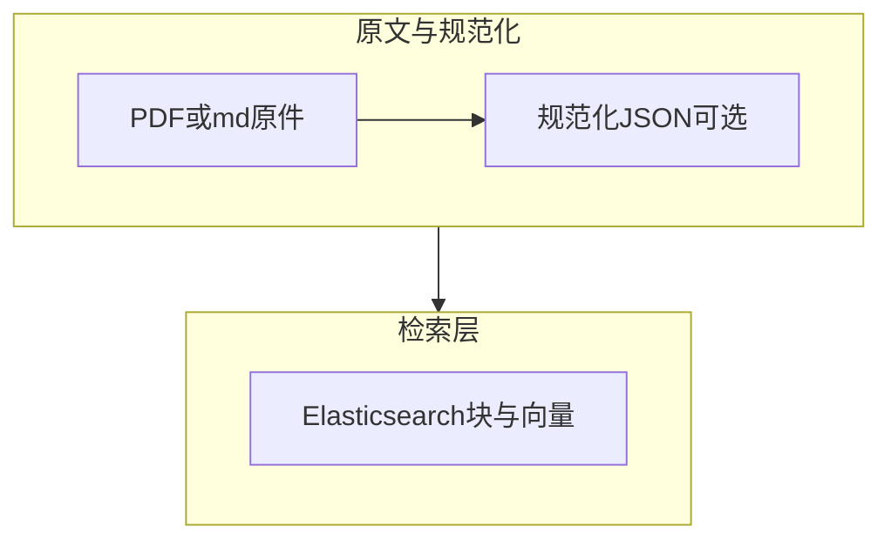

# 字符滑窗切分与可扩展存储（实现计划）

| 属性 | 说明 |
| --- | --- |
| 文档版本 | v1.0.1 |
| 状态 | 实施计划 |
| 关联 | 继承 [v1.0.0-rag-law-mvp-plan.md](v1.0.0-rag-law-mvp-plan.md) §9 第二条「切分」；在 v1.0.0 基线之上补充语料统计、参数建议与多类型/多领域扩展约定 |

---

## 1. 目标

实现：**遍历 `data/*.md`，UTF-8 读取，按 `CHUNK_SIZE` / `CHUNK_OVERLAP` 生成块并附元数据**，输出可供后续向量与入库使用的结构。

**已有基础**：[src/conf/settings.py](../../src/conf/settings.py) 提供 `chunk_size`、`chunk_overlap`（已校验 `overlap < size`）、`project_root()`；语料在仓库根目录 [data/](../../data/)。

---

## 2. 语料规模与参数建议（基于当前 `data/*.md`）

对仓库内 7 个文件用 `wc -m`（按**字符**计，中文一字一算，与 Python `len(str)` 一致）统计结果：

| 文件 | 约字符数 |
| --- | --- |
| 婚姻法.md | 4,795 |
| 劳动法.md | 8,997 |
| 劳动合同法.md | 12,728 |
| 行政复议法.md | 15,250 |
| 宪法.md | 18,836 |
| 民事诉讼法.md | 38,663 |
| 刑法.md | 80,005 |
| **合计** | **约 179,274** |

**结论与建议**

- 单部法律从不足 5k 到约 8 万字符，**滑窗块长不宜过小**（否则块数暴涨、单块语义过碎）；也不宜过大（检索粒度变粗、噪声多）。
- **CHUNK_SIZE**：建议 **1200～1800** 字符区间；与现有默认 **1500** 对齐即可，无需改 `.env` 除非希望略收紧检索粒度（例如 **1200**）或略放大条文上下文（例如 **1800**）。
- **CHUNK_OVERLAP**：建议 **80～150** 字符。默认 **50** 略偏保守；**100～128** 可在块边界处多保留半句到一句的衔接，利于法条跨块引用，相对 1500 约为 **5%～10%** 重叠。若更在意索引体积，可维持 **50**。

MVP 可直接：`CHUNK_SIZE=1500`、`CHUNK_OVERLAP=100`（或保持 `50`）。

---

## 3. 可扩展性：多类型、多领域、是否落盘、PDF→JSON

### 3.1 问题拆解

- **文件类型**：当前仅 Markdown；后续 **PDF**、可能的 **DOCX/HTML** 等，解析入口不同，但**进入「纯文本 + 结构化元数据」后，可与同一套滑窗逻辑衔接**。
- **领域**：除法律外可能有其他垂直领域；检索与展示往往需要 **按领域过滤**（`domain` / `collection`）。
- **切分结果是否单独存储**：向量库（ES）已存「块文本 + 向量 + 元数据」时，**不一定**再存一份「仅切块文件」；调试与审计可另议。

### 3.2 统一「规范化文档」抽象（便于 PDF→JSON）

实现切分时，将 `TextChunk` 的元数据设计成**可向前兼容**的字段集合（MVP 只填一部分）：

| 字段（概念） | MVP（仅 md 法律） | 后续扩展 |
| --- | --- | --- |
| `source_id` | 可用 `data/文件名.md` 的稳定 ID 或 hash | PDF 用文件 hash 或业务主键 |
| `source_uri` / `storage_path` | 仓库内相对路径 | 对象存储 URL 或本地路径 |
| `mime_type` | `text/markdown` | `application/pdf` 等 |
| `doc_type` | `law_md` | `law_pdf`、`general_pdf` 等 |
| `domain` | `law`（或从配置/目录映射） | `medical`、`general` 等 |
| `parser_version` | 可选 | PDF 解析器版本，便于重跑 |
| `extra` / `provenance` | 可空 | JSON：页码、章节标题、原 JSON 块 id 等 |

**PDF→JSON 路径**：解析管线输出统一 schema（例如 `pages[]` / `sections[]`，每段含 `text` 与可选 `page`、`bbox`）。**切分器只吃「拼接后的全文或按 section 的文本」**，与 md 共用滑窗；元数据把 `page` 等写入 `extra`，便于溯源。

### 3.3 存储策略（分层）

- **权威检索层（建议）**：**Elasticsearch** 存每条 chunk：`text`、`embedding`、以及上表元数据（`domain`、`doc_type`、`source_id`、`extra`）。**不必**为 RAG 再单独存「切块文件」，除非产品需要离线审计。
- **原文存储**：PDF 等大文件适合 **对象存储 / 网盘 / 仓库外路径**，库内只存引用；小 md 可继续放 `data/`。
- **可选中间产物**：调试或重跑需要时，可写 **JSONL**（每行一个 chunk + 元数据）到例如 `var/chunks/{run_id}.jsonl`（**gitignore**），不作为唯一数据源。

### 3.4 本步代码的落地要求（增量）

- `TextChunk`（或等价结构）**预留** `domain`、`doc_type`、`mime_type`、`extra` 等可选字段，MVP 对 md 填默认值（如 `domain="law"`，`doc_type="law_md"`）。
- 切分入口预留 `normalize_document(text, meta) -> Iterable[TextChunk]` 或先「从 NormalizedDocument 取 text 再滑窗」，避免未来为 PDF 重写滑窗。
- 配置层后续可增加 `DEFAULT_DOMAIN`、按子目录映射 `domain` 等（不必本步做完）。

### 3.5 本步不实现

- 实际 PDF 解析库接入、对象存储 SDK。
- MySQL 级「文档主表」（若上规模可再引入，与 ES 元数据对齐）。

---

## 4. 建议实现

### 4.1 包与文件布局

在 [src/chunking/](../../src/chunking/)（与 `src/conf` 并列）新增：

| 文件 | 职责 |
| --- | --- |
| `__init__.py` | 导出公开 API（如 `TextChunk`、`iter_file_chunks`、`load_data_chunks`） |
| `split.py`（或 `chunk.py`） | 纯函数：单文本滑窗 + 单文件/目录入口 |

不引入新依赖；类型用 `dataclasses.dataclass` 或 `typing.NamedTuple` 即可。

### 4.2 数据结构与元数据

每个块建议包含：

- `text: str`：块正文（与 MVP 计划 §6 ES `text` 字段对应）
- `source_file: str`：文件名，如 `宪法.md`（仅 basename）
- `chunk_index: int`：该文件内从 0 递增
- `char_start` / `char_end`：在原文件**完整文本**中的字符偏移（Python `str` 下标）

可选：`source_path` 存相对路径 `data/宪法.md`。

**与 §3 对齐的可选字段**：`source_id`、`mime_type`、`doc_type`、`domain`、`extra`（MVP 可对 md 法律填默认值）。

### 4.3 滑窗算法

- 使用 `conf.get_settings()` 或显式传入 `chunk_size`、`chunk_overlap`（便于测试）。
- **步长**：`step = chunk_size - chunk_overlap`。
- 对长度为 `n` 的字符串，从 `start = 0` 开始，每次取 `[start, min(start + chunk_size, n))`；若已到达文末则结束；否则 `start += step`。
- **空文件**：不产生块（或文档中约定 0 块，实现选一种并写清）。

### 4.4 文件遍历

- 根目录：`project_root() / "data"`。
- 仅 `*.md`：`sorted(Path.glob("*.md"))` 保证顺序稳定。
- 读取：`path.read_text(encoding="utf-8")`；异常处理策略 MVP 可先直接抛出。

### 4.5 对外 API

- **生成器**：`iter_chunks_for_data_dir(data_dir: Path | None = None) -> Iterator[TextChunk]`，默认 `project_root() / "data"`。
- **列表**：`load_all_chunks(...) -> list[TextChunk]`（内部 `list(iter...)`）。

### 4.6 测试

新增 [tests/test_chunking/test_split.py](../../tests/test_chunking/test_split.py)（目录名避免与包名 `chunking` 冲突，同 `test_conf` 做法）：

- 短字符串 + 已知 `chunk_size`/`overlap`，断言块数、每块 `text` 与 `char_start`/`char_end`。
- 边界：`chunk_size` 大于文本长度（单块）；`overlap` 为 0（无重叠）。
- 可选：临时目录 + `fixture.md`，测 `glob` 与多文件 `chunk_index` 从 0 独立计数。

`chunking` 可先不强求与 `conf` 相同的覆盖率门槛，但核心逻辑应有测试。

### 4.7 与后续步骤的衔接

- **向量模块**：消费 `TextChunk.text` 与元数据写入 ES。
- **v1.0.0 计划文档**：实现完成后将 §9「切分」一条改为 `- [x]`。

---

## 5. 不在本步范围

- BGE-M3 向量化、ES 写入（后续步骤）。
- 按「条/款」语义切分（v1.0.0 计划中的扩展项）。

---

## 6. 版本记录

| 版本 | 日期 | 说明 |
| --- | --- | --- |
| v1.0.1 | 2026-04-06 | 切分实现计划：语料统计、CHUNK 参数建议、多类型/多领域与存储分层、TextChunk 元数据扩展、`src/chunking` 布局与测试约定 |
| v1.0.0 | 2026-04-05 | MVP 总计划基线（见同目录 v1.0.0 文件） |

后续若仅修订本计划，可递增补丁版本（如 v1.0.2）并更新本节。
