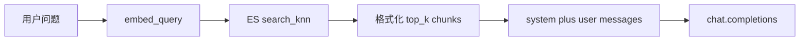

# MVP 问答闭环（实现计划）

| 属性 | 说明 |
| --- | --- |
| 文档版本 | v1.0.5 |
| 状态 | 规划中（对应 [v1.0.0-rag-law-mvp-plan.md](v1.0.0-rag-law-mvp-plan.md) §9「问答」未勾选项） |
| 关联 | 承接 [v1.0.4-ingest-plan.md](v1.0.4-ingest-plan.md)（索引已有 chunk）；[v1.0.3-es-store-plan.md](v1.0.3-es-store-plan.md)（`search_knn`）；[v1.0.2-bge-m3-embedding-plan.md](v1.0.2-bge-m3-embedding-plan.md)（`embed_query`）；LLM 依赖与冒烟见 [`scripts/llm_smoke_test.py`](../../scripts/llm_smoke_test.py)、[`pyproject.toml`](../../pyproject.toml) **`llm`** extra |
| 范围 | **单条查询 CLI 或薄封装**：用户问题 → 查询向量 → ES kNN → 拼接 **system / user** 提示 → OpenAI 兼容 `chat.completions` 返回答案；**不含** Web API、重排、多轮会话、流式输出（可后续迭代） |

---

## 1. 目标

1. 实现与 MVP §3「在线问答」一致的链路：`query` → `embed_query` → `EsChunkStore.search_knn` → **上下文块** → **LLM**。
2. **提示词**：**system** 固定角色与行为约束（须基于给定材料作答、**标注引用来源**、检索材料不足以回答时**明确声明无法律/条文依据**）；**user** 含用户问题 + 结构化检索片段（便于模型引用）。
3. **调用方式**：`openai` 包 `OpenAI(base_url=..., api_key=...)`，与 [`.env.example`](../../.env.example) 中 `MODEL_*` 一致；与 [`scripts/llm_smoke_test.py`](../../scripts/llm_smoke_test.py) 同源配置。

**不在本版本**：FastAPI 服务、会话记忆、BM25 混合检索、rerank、引用解析为可点击链接。

---

## 2. 数据流

---

## 3. 检索与参数

| 项 | 说明 |
| --- | --- |
| `k` | 默认 `settings.retrieval_k`；CLI 可 `--k` 覆盖 |
| 索引 | `settings.es_index`（与入库一致） |
| 向量 | `build_embedder(settings).embed_query(query)`，维度与索引 `dense_vector` 一致 |

**空结果**：若 kNN 返回 0 条，仍可向 LLM 发送 **user**（注明「未检索到相关片段」），由 **system** 约束模型作**无法律依据**类答复；或脚本直接打印提示并 **exit 1**（实现时二选一，建议 **仍调用 LLM** 以保持行为一致）。

---

## 4. 提示词设计（建议稿）

### 4.1 system

- 角色：中文法律领域助手，**仅**根据下方用户消息中给出的「检索片段」作答。
- 必须：
  - 回答中引用具体片段时，用**简短编号**（如「依据片段 1」「依据片段 2」）或 **文件名 + 序号**（与 user 中标签一致）。
  - 若片段与问题无关或无法从中推出结论，须**明确说明**：例如「根据当前检索到的材料，无法确定……」或「所提供的片段中未包含直接依据」，**禁止编造条文**。

### 4.2 user（拼接结构）

建议分节，便于模型解析：

1. **【用户问题】**（单行或多行）
2. **【检索片段】**（每条命中一行或一块，带序号与元数据）  
   示例标签：`[1] 来源: {source_file} 块序号: {chunk_index}`，换行后跟 `text` 截断（或全文，注意总 token 上限）。

**Token 上限**：MVP 可对 `text` 做 **字符截断**（如每块最多 800～1500 字）或按 `MODEL_NAME` 保守估计，避免超长 prompt；可在 [`conf/settings`](../../src/conf/settings.py) 中增加可选 `QA_MAX_CONTEXT_CHARS`（实施时再定）。

---

## 5. 代码与交付形态

| 建议路径 | 职责 |
| --- | --- |
| [`src/qa/`](../../src/qa/)（新建） | `build_messages(query, hits) -> list[dict]`；`answer_question(settings, query) -> str`（内部：embed、knn、OpenAI 调用） |
| [`scripts/rag_qa.py`](../../scripts/rag_qa.py)（新建） | `uv run python scripts/rag_qa.py "你的问题"`；参数：`--k`、`--dry-run`（仅打印 messages 不调用 LLM） |

与仓库惯例一致：`sys.path` 含 `src`、`chdir` 项目根；**勿**使用与包名冲突的脚本文件名。

**依赖**：`uv sync --extra embedding --extra llm`（或等价组合，见 [`README.md`](../../README.md)）。

---

## 6. 测试与验收

| 项 | 说明 |
| --- | --- |
| 单元测试 | 对 `build_messages`（无网络）：断言 system/user 含关键词、片段编号格式 |
| 集成测试 | 可选 `@pytest.mark.integration`，无 ES/无 key 时 skip |
| 人工验收 | 与 MVP §9「验收」一致：1～2 个法律问题，检查答案是否引用片段、无依据时是否声明 |

**脚本自检**：`--dry-run` 打印 `messages` JSON 或摘要（**脱敏**）。

---

## 7. 风险与注意

- **合规**：输出为辅助信息，非法律意见；system 中可加一句「不构成法律意见」类免责声明（可选）。
- **费用**：每次问答一次 `embed_query` + 一次 `chat.completions`；长上下文会增费。
- **幻觉**：依赖 system 约束 + 检索质量；MVP 以**可观测**（打印引用片段）为主。

---

## 8. 实施任务清单（建议顺序）

1. [ ] 新建 `src/qa/`：`prompts` 或单模块内常量 + `build_messages`。
2. [ ] 实现 `answer_question`（或 `run_qa_pipeline`）：embed → `EsChunkStore.search_knn` → OpenAI → 返回 `content`。
3. [ ] 新增 `scripts/rag_qa.py`（CLI、`--dry-run`、`--k`）。
4. [ ] 单元测试 + README 小节；[v1.0.0-rag-law-mvp-plan.md](v1.0.0-rag-law-mvp-plan.md) §9「问答」勾选（实施完成后）。

---

## 9. 版本记录

| 版本 | 日期 | 说明 |
| --- | --- | --- |
| v1.0.5 | 2026-04 | MVP 问答：system/user 提示、引用与无法律依据声明、OpenAI 兼容接口、CLI 与 `src/qa` 建议 |

后续修订可递增补丁版本（如 v1.0.6）并更新本节。
