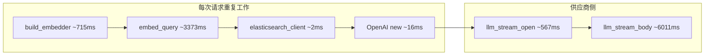

# QA WebUI 耗时分析与性能优化（实现计划）

| 属性 | 说明 |
| --- | --- |
| 文档版本 | v1.0.8 |
| 状态 | 已实施（lifespan 单例、`stream_qa_events` 注入，见 [`src/qa/webui/app.py`](../../src/qa/webui/app.py)） |
| 关联 | 承接 [v1.0.7-qa-webui-plan.md](v1.0.7-qa-webui-plan.md)（[`src/qa/streaming.py`](../../src/qa/streaming.py)、[`src/qa/webui/`](../../src/qa/webui/)）；样本数据来自一次真实问答页分阶段耗时 |

---

## 1. 数据解读（相对一次采样的数量级）

| 阶段 | 耗时（示例） | 占比直觉 | 含义 |
| --- | --- | --- | --- |
| `embedder_acquire` | ~715 ms | **高** | 与 [`BgeM3EmbeddingBackend`](../../src/embeddings/bge_m3.py) 每次 `BGEM3FlagModel(...)` 从磁盘加载权重一致；当前 [`stream_qa_events`](../../src/qa/streaming.py) **每请求** `build_embedder(settings)`，未复用实例。 |
| `embed_query` | ~3373 ms | **最高（RAG 侧）** | 单次查询向量推理；若与「刚加载完模型」同一次请求，可能叠加热身（torch/算子首次执行）；CPU 上 BGE-M3 也可能达到秒级。 |
| `es_client_acquire` | ~2 ms | 低 | 新建 ES 客户端成本小，但仍可省掉重复构造。 |
| `es_search_knn` | ~36 ms | 正常 | 与集群/数据量相关，通常不是首要优化点。 |
| `build_messages` | 小于 1 ms | 可忽略 | — |
| `llm_client_ready` | ~16 ms | 中 | 每次 `OpenAI(...)`；可复用以复用底层 HTTP 连接。 |
| `llm_stream_open` | ~567 ms | **中高** | 从发起 `chat.completions.create(stream=True)` 到流对象就绪/首包前等待，含**网络 RTT + 供应商排队 + TLS**。 |
| `llm_first_token_wait` | ~1.4 ms | 低 | 流已建立后，首个内容 delta 很快到达。 |
| `llm_stream_body` | ~6011 ms | **最高（总时间）** | **纯生成**，与模型、输出长度、`max_tokens`、供应商负载强相关，**预加载代码无法直接缩短**（除非换模型/限长/缓存答案）。 |
| `response_finalize` | 小于 1 ms | 可忽略 | — |

**粗算**：首 token 前（约 offset 4.7s 前）主要是 **向量加载 + 向量推理 + LLM 建连/首包等待**；总时长约 10.7s 里 **一半以上是流式生成**。

---

## 2. 结论：是否「启动时预加载、空间换时间」？

**是，且对当前架构收益最大的一类优化**，主要针对：

1. **`embedder_acquire`**：把 **一个进程内单例** `EmbeddingBackend`（或 `build_embedder` 结果）在 **uvicorn worker 启动时**（FastAPI `lifespan` / `startup`）创建并挂到 `app.state`，请求路径只 `embed_query`，**可预期省掉约 700ms/请求**，并避免重复占显存/内存峰值波动。
2. **`elasticsearch_client` / `OpenAI` 客户端**：同样 **单例复用**，省掉重复构造与小对象分配，并有利于 **HTTP keep-alive**，对 `llm_stream_open` 可能有 **数十到数百 ms** 量级的改善（视网络与供应商而定，不保证固定数值）。
3. **可选「预热」**：启动后对 embedder 做一次 **极短 dummy `embed_query("ping")`**，把部分首次推理开销前移到启动阶段，使**首个用户请求**的 `embed_query` 更接近稳态（对「第二个请求」帮助更明显）。

**空间代价**：BGE-M3 常驻内存（若 GPU 则显存）；多 worker 多进程时 **每 worker 一份模型**（常见做法：减少 worker 数为 1，或接受多副本内存）。

---

## 3. 分方向优化建议（按性价比排序）

### A. 应用层：单例与生命周期（强烈推荐）

- 在 [`qa/webui/app.py`](../../src/qa/webui/app.py)（或独立 `qa/deps.py`）中：
  - `startup`：`get_settings()` → `build_embedder(settings)` → 存 `app.state.embedder`；`elasticsearch_client(settings)` → `app.state.es_client`；`OpenAI(...)` → `app.state.llm_client`。
  - `stream_qa_events` 改为 **接受注入**（`embedder=`、`es_client=`、`openai_client=`）或从 **上下文/全局单例** 读取，**禁止每请求 `build_embedder`**。
- CLI [`scripts/rag_qa.py`](../../scripts/rag_qa.py) 可保持「单次进程单次加载」现状，或同样抽共享工厂以便一致。

### B. 向量侧：降低 `embed_query` 的秒级耗时

- **硬件**：若有 NVIDIA GPU，确认 [`bge_m3.py`](../../src/embeddings/bge_m3.py) 中 `use_fp16 = torch.cuda.is_available()` 生效，GPU 上通常比 CPU 快一个数量级。
- **预热**：启动时一次 dummy encode（见上）。
- **产品权衡**：更小维度/更快模型（需与 ES mapping 维度一致并重索引）；或独立 **向量微服务** 常驻（复杂度更高）。

### C. LLM 侧：`llm_stream_open` 与 `llm_stream_body`

- **连接复用**：单例 `OpenAI` 客户端 + 合理 `timeout`/`max_retries`（按官方建议）。
- **地域与线路**：`MODEL_BASE_URL` 选离运行环境近的 endpoint，降低 RTT。
- **生成段**：调低默认 `max_tokens`（WebUI 与 API 默认值）、换更快模型；**引用缓存**仅适用于完全相同 query（法律场景命中率通常低，谨慎）。

### D. ES 侧

- 数十毫秒级已较健康；若索引大或远程 ES，可 **同机/同 VPC** 部署；`k` 与 `num_candidates` 微调属次要。

---

## 4. 实施顺序建议（落地时）

1. **FastAPI lifespan 注入 embedder + ES + OpenAI 单例**，改 `stream_qa_events` 使用注入实例（配套单测 mock 注入）。
2. 可选：**startup 预热 `embed_query`**。
3. 再评估：`embed_query` 仍慢则查 **CPU/GPU** 与 **torch 线程数**（`OMP_NUM_THREADS` 等）。
4. 文档：在 [v1.0.7-qa-webui-plan.md](v1.0.7-qa-webui-plan.md) 或 [README.md](../../README.md) 注明「Web 服务建议单 worker 或每 worker 预加载模型」。

---

## 5. 风险与注意

- **多 worker**：每个 worker 各加载一份 BGE-M3，内存成倍增加；**单 worker** 常为本地调试默认。
- **配置热更**：若 `.env` 变更需重启进程才能换模型路径，可接受为 MVP。
- **线程安全**：`BGEM3FlagModel` 若不支持并发推理，需 **async 路径加锁** 或队列（视实际并发需求）。

---

## 6. 实施任务清单（建议顺序）

1. [x] FastAPI lifespan：`app.state` 注入 embedder、Elasticsearch、OpenAI 单例。
2. [x] `stream_qa_events` 改为使用注入的 embedder/客户端，移除每请求 `build_embedder`（WebUI 路径）；未注入时 CLI/单测行为不变。
3. [x] 可选：向量侧 MPS 预热已由 [`src/embeddings/bge_m3.py`](../../src/embeddings/bge_m3.py) `_maybe_warmup_mps` 覆盖；未在 lifespan 内重复 dummy encode。
4. [x] 更新 `tests/test_qa/test_streaming.py` / `test_webui_app.py`：注入单测与 `cached` 阶段断言。
5. [x] README 补充 Web 单 worker 说明（见下文与 [README.md](../../README.md)）。

---

## 7. 版本记录

| 版本 | 日期 | 说明 |
| --- | --- | --- |
| v1.0.8 | 2026-04-05 | 首版：基于采样耗时的瓶颈分析、空间换预加载方案与实施顺序 |
| v1.0.8 修订 | 2026-04-05 | 落地 lifespan 单例、`stream_qa_events` 可选注入与 `cached` 阶段事件 |

后续修订可递增补丁版本（如 v1.0.9）并更新本节。
