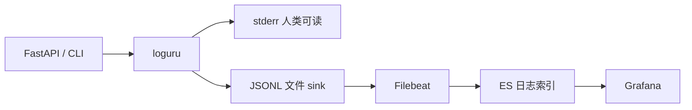

# v1.1.1 观测栈：JSONL、Filebeat、Elasticsearch 与 Grafana

| 属性 | 说明 |
| --- | --- |
| 文档版本 | v1.1.1 |
| 状态 | 已实施（QA 监控 JSONL + 可选 ES；Filebeat/Grafana 仍为部署侧可选） |
| 前置 | v1.1.0 日志统一配置（`configure_logging`、人类可读 stderr/可选文件）；计划文档 `v1.1.0-logging-plan.md` 与 v1.1.0 实施任务一并交付 |
| 适用范围 | 结构化日志落盘、采集入 ES、在 Grafana 中查询与做运维面板 |

---

## 1. 目标与范围

在 v1.1.0 已统一 `loguru` 与初始化入口的前提下，增加**可机读、可采集**的观测数据流：

- **JSONL**：应用将结构化日志以**一行一个 JSON 对象**写入磁盘，便于 Filebeat 按行解析。
- **Filebeat**：与进程同机（或同容器 sidecar）读取 JSONL，输出到 **Elasticsearch 日志专用索引**。
- **Grafana**：连接上述日志索引（**不是** RAG 向量业务索引），做错误率、延迟分位数、请求量等面板。

**职责分离**：日志/观测索引与 `ES_INDEX` 所指的 **RAG 文档块索引**在索引名前缀、ILM、保留策略上**明确分开**；同一 ES 集群可共用，但禁止把日志与 `dense_vector` 业务数据混在同一索引中。

**不在本版本必选项**：独立监控集群（资源允许时更稳妥，个人/小团队可先同集群不同索引前缀）。

---

## 1.1 QA 请求监控（已实现）

问答流（`stream_qa_events` / WebUI SSE）在每次请求**结束**时（成功或 LLM 流异常）写入一条**结构化监控记录**，字段与 `qa.streaming` 内阶段计时对齐。

**落盘**：默认 **`logs/monitor.log`**（JSONL，一行一条 JSON）。通过环境变量 **`MONITOR_LOG_FILE`** 覆盖路径；设为空字符串可关闭文件写入。

**Elasticsearch**：可选将同一条记录写入专用索引 **`rag-law-monitor`**（与 `ES_INDEX` 文档块索引分离）。通过 **`MONITOR_ES_ENABLED=true`** 开启；索引名由 **`MONITOR_ES_INDEX`** 覆盖（默认 `rag-law-monitor`）。使用与业务相同的 `ES_*` 连接配置。

**建议字段（与实现对齐）**：

| 字段 | 说明 |
| --- | --- |
| `@timestamp` | ISO 8601 UTC，供 ES 时间轴 |
| `service` | 固定 `rag-law-qa` |
| `event` | 固定 `qa_request` |
| `ok` | 请求是否完成且无 LLM 流异常 |
| `conversation_id` | 可选，多轮预留 |
| `query_len` / `query_fp` | 问题长度与 SHA256 前缀（**不记录原文**） |
| `retrieval_k` | 本次请求使用的 k（含请求体覆盖默认） |
| `retrieval_hit_count` | ES kNN 实际返回条数 |
| `total_ms` | 自进入流式生成器起的**全程总耗时** |
| `ttft_ms` | **首字延迟**（首 token 相对起点；无输出时为 `null`） |
| `rag_prefill_ms` | RAG 侧预填充（检索与拼 prompt 完成）耗时 |
| `llm_total_ms` | **大模型总耗时**（自 `chat.completions.create(stream=True)` 返回到流结束） |
| `embed_query_ms` / `es_search_knn_ms` | 与阶段 `embed_query`、`es_search_knn` 一致 |
| `timings` | 各阶段毫秒对象（含 `settings_resolve`、`build_messages`、`llm_stream_open`、`llm_first_token_wait`、`llm_stream_body` 等） |

轮转：可与 v1.1.1 第 4 节一致，对 `logs/monitor.log` 配置按大小/按天轮转（实现上可先依赖运维侧 logrotate 或后续接入 loguru 专用 sink）。

---

## 2. 与 v1.1.0 的衔接



- v1.1.0：控制台（及可选普通文本文件）用于开发排障。
- v1.1.1：在 `configure_logging` 中**增加第二个 sink**，仅写 JSONL（或生产环境通过 `LOG_JSON_FILE` 等配置启用）；可对 JSONL sink 使用 `enqueue=True` 以降低高并发写盘对请求路径的阻塞。

---

## 3. JSONL 字段约定

**格式**：每行一个 JSON 对象，无换行嵌套；Filebeat 默认 `json` 解析友好。

**建议最小字段集**（名称可与实现微调，但应在文档与代码中保持一致）：

| 字段 | 类型 | 说明 |
| --- | --- | --- |
| `@timestamp` | string | ISO 8601 UTC 或带时区，与 ES 时间字段对齐 |
| `level` | string | `DEBUG` / `INFO` / `WARNING` / `ERROR` 等 |
| `logger` | string | logger 名称，便于过滤子系统 |
| `message` | string | 人类可读摘要；**禁止**写入完整用户原文时见第 7 节 |
| `service` | string | 固定服务名，如 `rag-law-qa`、`rag-law-ingest` |

**HTTP 与性能（若适用）**：

| 字段 | 说明 |
| --- | --- |
| `http.request.method` | `GET`、`POST` 等 |
| `http.request.path` | 路径（可不含 query，避免泄露敏感 query 参数） |
| `http.response.status_code` | 整数 |
| `duration_ms` | 请求或阶段耗时（毫秒） |
| `trace_id` | 与 v1.1.0 请求 ID 对齐，便于贯穿检索与 LLM 阶段 |

**扩展**：业务阶段日志可与现有 SSE `phase` 语义对齐；`extra` 中可增加 `phase`、`retrieval_k` 等，**不重复记录**整段用户 query（默认截断、hash 或不写，见第 7 节）。

---

## 4. 落盘路径与轮转（rotation / retention）

**默认路径示例**：`logs/rag-law.jsonl`（可通过配置覆盖，如 `LOG_JSON_FILE`）。

**轮转与保留**（使用 loguru 的 `rotation` / `retention`）：

| 策略 | 建议 |
| --- | --- |
| 按大小 | 例如单文件达到 50MB～200MB 轮转，避免单文件过大影响 tail |
| 按时间 | 例如每日 `00:00` 轮转，便于与 Filebeat 索引按日模式对齐 |
| 保留 | 本地保留最近 N 天或 N 个文件，避免磁盘占满；与 ES ILM 长期保留策略配合 |

**注意**：开发环境可仅 stderr；生产启用 JSONL 时，确保 `logs/` 目录权限与磁盘监控；高并发下 JSONL sink 可考虑 `enqueue=True`。

---

## 5. Filebeat 与 Elasticsearch 索引前缀

**部署**：Filebeat 与产生日志的进程同机或同编排单元，`filebeat.yml` 中 `paths` 指向上节 JSONL 文件。

**解析**：按官方文档配置 JSON 解码（如 `json.keys_under_root`、`json.add_error_key` 等），使解析失败行可观测、不静默丢弃。

**输出索引命名**（与 RAG 业务索引分离）：

- **强建议**使用专用前缀，例如：`rag-law-logs-*` 或 `filebeat-rag-law-%{+yyyy.MM.dd}`。
- 与 `.env` 中 **`ES_INDEX`（文档块向量索引）** 使用不同前缀；`.env.example` 中已有「文档块索引 / 日志可预留」的说明方向一致。

**权限**：Filebeat 使用的 ES 用户仅需**日志索引写入**（及必要的 cluster 权限），与 RAG 索引读写用户分离（最小权限）。

**ILM**：为日志索引单独配置 ILM：热温冷、删除阶段与保留天数，避免与向量索引争抢或误删业务数据。

---

## 6. Grafana 面板目标

数据源：**Elasticsearch**，指向**第 5 节日志索引**（非 `dense_vector` 的 RAG 索引）。

建议首版面板目标：

| 面板 | 目标 |
| --- | --- |
| 错误趋势 | 按时间聚合 `level:ERROR`（或等价）计数 |
| 延迟 | `duration_ms` 的 P50、P95、P99（或按路由分组） |
| 流量 | 每分钟/每秒请求量（可按 `http.request.path` 或 `service` 分组） |
| 状态码分布 | `http.response.status_code` 堆叠或饼图 |
| 服务维度 | 按 `service` 分面，对比各子系统错误与延迟 |

查询语言随 ES/Grafana 版本选用 Lucene、KQL 或 ES|QL；联调时在目标环境验证时间字段与字段映射。

---

## 6.1 Grafana Lucene 查询参考（QA 监控）

以下查询基于 `conf.monitor.build_qa_monitor_document` 当前字段：`event`、`service`、`ok`、`query_len`、`total_ms`、`ttft_ms`、`llm_total_ms`、`embed_query_ms`、`es_search_knn_ms`、`retrieval_k`、`retrieval_hit_count`。

**基础过滤**：

```text
event:"qa_request" AND service:"rag-law-qa"
```

**成功 / 失败**：

```text
ok:true
```

```text
ok:false
```

**慢请求（全程总耗时）**：

```text
total_ms:>5000
```

**长 query（按字符长度）**：

```text
query_len:>500
```

**慢 embedding（`embed_query` 阶段）**：

```text
embed_query_ms:>200
```

**检索命中数量过滤**：

```text
retrieval_hit_count:[1 TO *]
```

**字段存在性（排除缺失值）**：

```text
_exists_:embed_query_ms
```

> 注：若你的采集链路把 JSON 包在 `json.*` 下（例如 `json.total_ms`），请改成实际字段名。

### 面板配置要点

- **QPS**：Lucene 用 `event:"qa_request" AND service:"rag-law-qa"`，Metric 选 **Count**，Group by `@timestamp` 的 **Date histogram**（`1s` 或 `1m`）。
- **query_len 趋势**：Metric 选 **Average(query_len)**，按 `@timestamp` 分桶。
- **total_ms / embed_query_ms 延迟**：Metric 选 **Average** 或 **Percentiles(P95/P99)**，字段分别为 `total_ms`、`embed_query_ms`。
- **检索质量观察**：Metric 选 **Average(retrieval_hit_count)** 或配合过滤 `retrieval_hit_count:0` 看空命中占比。

---

## 7. 安全与隐私红线

- **禁止**写入：`MODEL_API_KEY`、完整 `.env`、OSS/云密钥等；仅可记录「已配置 / 缺失」类布尔信息。
- **用户 query**：默认**截断**、**hash** 或**不写**全文；与 v1.1.0 计划一致，避免合规风险。

---

## 8. 交付物与验收（摘要）

**交付物**：

- 代码侧：JSONL sink、字段契约、轮转配置项；**QA 监控**已实现为 `conf.monitor` + `stream_qa_events` 结束钩子（`logs/monitor.log`、可选 `MONITOR_ES_*`）。
- 运维侧：Filebeat / Grafana **示例片段**（`.example` 后缀），不含真实密钥；可选 README「观测栈」小节：部署顺序、与 `ES_*` 的关系说明。

**验收**：

- JSONL 可被 Filebeat 解析并写入**独立前缀**的 ES 索引。
- Grafana 能按时间查询 ERROR，并展示延迟统计（在目标环境至少联调通过一次）。

**验收（QA 监控，§1.1）**：

- `logs/monitor.log` 每行一条 JSON，含 `embed_query_ms` / `es_search_knn_ms` / `ttft_ms` / `llm_total_ms` / `retrieval_hit_count` / `retrieval_k` / `timings` 等。
- 设置 `MONITOR_ES_ENABLED=true` 时，同一条文档写入 `MONITOR_ES_INDEX`（默认 `rag-law-monitor`），与 `ES_INDEX` 文档块索引分离。

---

## 9. 参考

- 仓库 MVP 与 ES 索引约定：[v1.0.0-rag-law-mvp-plan.md](v1.0.0-rag-law-mvp-plan.md)、[v1.0.3-es-store-plan.md](v1.0.3-es-store-plan.md)
- 日志统一（v1.1.0）：`v1.1.0-logging-plan.md`（v1.1.0 任务交付后与本文档交叉引用）
