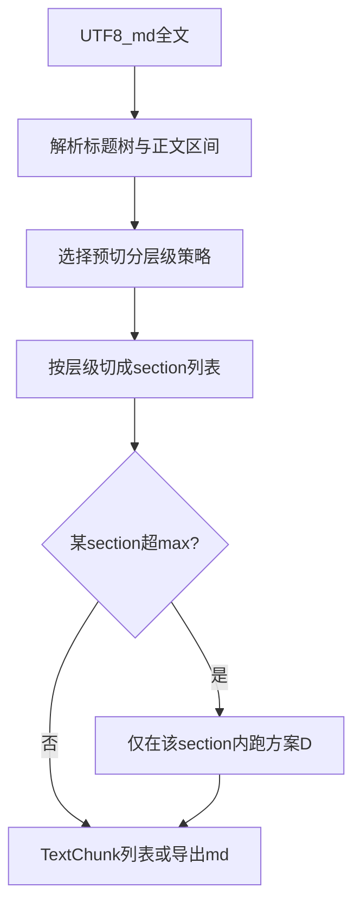

# v1.1.10 Markdown 标题层级预切分 + 方案 D 二级切分

| 属性 | 说明 |
| --- | --- |
| 文档版本 | v1.1.10（方案设计，待评审后实施） |
| 前置 | [v1.1.7-semantic-chunking-bcd-plan.md](v1.1.7-semantic-chunking-bcd-plan.md)（B/C/D 总览）、[v1.1.9-scheme-d-concrete.md](v1.1.9-scheme-d-concrete.md)（方案 D）、[v1.1.8-scheme-d-eval.md](v1.1.8-scheme-d-eval.md)（D 评测） |
| 关联代码（预期） | `src/chunking/` 新增或扩展模块；与 [`document_segmentation.py`](../src/chunking/document_segmentation.py)、[`ingest/loaders.py`](../src/ingest/loaders.py) 的衔接在 §6 说明 |

---

## 1. 目标与动机

**目标**：对 **Markdown 法规/文书** 做切块时，先利用 **标题层级（ATX `#`…`######`）** 做 **预切分**（粗粒度、可解释、与版式一致）；当某一标题下正文 **超过长度上限** 时，再在该标题范围内调用 **方案 D**（文档分段模型 + 既有 min/max/换行优先再切分）做二级切分。

**动机**：

- MinerU 等来源的法规 md 中，**章/节** 常以 **一级标题 `#`** 重复出现（例如 [data/md_minerU/md3__婚姻法.md](../data/md_minerU/md3__婚姻法.md) 中 `# 第一章 总则`、`# 第二章 结婚` 等），与「纯滑窗」相比，预切分能 **优先保证章界不被模型或长度窗撕开**。
- 标题结构 **因文档而异**（见 §3），必须 **可配置、可扩展**，避免写死「永远按二级标题切」。

**非目标（本版可不实现）**：

- 不替代 BGE 检索向量；D 仍仅作为「段内细分」边界来源之一。
- 不要求完美解析 Setext 标题（`===` 下划线式）；若后续语料出现再扩展。

---

## 2. 两阶段流水线（概念）

- **阶段 A（预切分）**：仅依据 Markdown 结构，产出 `List[Section]`，每段带 `heading_level`、`heading_title`、`char_start/char_end`（或等价切片）。
- **阶段 B（段内方案 D）**：若 `len(section.text) > DOC_SEGMENTATION_SECTION_MAX_CHARS`（或沿用 `DOC_SEGMENTATION_MAX_CHARS` 的派生阈值），则对该 **子串** 调用现有 `infer_raw_ranges_from_pipeline` + `iter_document_segmentation_chunks_for_text`（区间坐标需 **映射回全文**）。

---

## 3. 标题层级多样性与扩展位

实际 md 中常见差异（需在设计上 **显式枚举并留扩展点**）：

| 类型 | 表现 | 对默认启发式的影响 |
| --- | --- | --- |
| A | **多个一级标题**（如多章均为 `# 第x章`） | 一级计数大，常作为预切分锚点 |
| B | **仅一个一级标题**（篇名），其下 **多个二级标题** | 一级计数=1，应在 **≥2 个标题的层级中取最深**，多为二级 |
| C | **无一级标题**，最浅为 `##` 或 `###`（甚至整篇只有更深标题） | 一级计数=0，需在 **出现的层级** 上统计 |
| D | **目录块** 与正文章标题 **同级 `#`**（MinerU 常见：`# 目 录` 与 `# 第一章` 同级） | 可能产生 **过细** 预切分；需可选策略「跳过目录标题模式」或合并目录节（见 §5） |
| E | 正文中 **代码块 / 引用** 内含 `#` 行 | 解析时应 **跳过 fenced code**（可选首版简化：仅 ATX 行首规则 + 后续加强） |

**扩展空间（建议写入 Settings / 策略枚举，而非写死一种逻辑）**：

- **`CHUNK_MD_HEADING_STRATEGY`**（名称示例）：  
  - `deepest_with_multiple`（**默认**，见 §4）  
  - `shallowest_with_multiple`（在「出现次数 ≥2 的层级」中取 **最浅**，适合希望「少而大」的节）  
  - `fixed_level:2`（强制按二级切）  
  - `none`（不做标题预切分，退化为全文 D 或现有链路）  
- 后续可插 **插件式** 策略：如 `mineru_law_v1`（结合「目录」标题正则、章条正则），与通用 ATX 策略并列。

---

## 4. 默认启发式：「最大的有多个的标题是几级」

将用户口语 **「最大的有多个的标题是几级」** 落实为 **可实现的定义**（若评审有更优定义，以代码注释 + 本文同步为准）：

**定义 1（默认：`deepest_with_multiple`）**

1. 扫描全文，解析 **ATX 标题** 行：行首为 `#`…`######` + 空格 + 标题文本，得到每条标题的 **层级** `L ∈ {1,…,6}` 与行号/字符偏移。
2. 对每个出现的层级 `L`，统计该文档中 **该层级的标题个数** `count(L)`。
3. 令集合 `S = { L | count(L) ≥ 2 }`（「有多个」= 至少两个同级标题）。
4. 若 `S` 非空：取 **`split_level = max(S)`**（数字最大 = **嵌套最深** 的那一级里，仍出现多次的那一层）。在该层上 **每个标题开启一个新 section**（section 范围为从该标题行首到下一 **同级或更浅** 标题之前）。
5. 若 `S` 为空（例如每个层级最多 1 个标题）：  
   - **回退 5a**：若存在 **任意** 标题，取 **最浅出现层级** `min({L})`，整篇仅在第一个该层标题处切分可能不足 → 更合理的是 **整篇作为一个 section**（或仅按「第一个一级到文末」），再完全交给阶段 B 的长度 + D；  
   - **回退 5b**：若 **无任何 ATX 标题**，则 **不进行标题预切分**，`sections = [全文]`，直接进入阶段 B。

**说明**：「最大」在层级数字上 = **最深**（六级最深）；与「一级最浅」相反，本默认 **偏细**，有利于章多、同级 `#` 多的法规（与当前 MinerU 婚姻法结构一致）。若产品更希望「少而大」，可切换 `shallowest_with_multiple`。

**与类型 B 的对齐**：仅 1 个 `#`、多个 `##` 时，`count(1)=1` 不进 `S`，`count(2)≥2` 进 `S`，`max(S)=2` → 按二级预切分，符合直觉。

---

## 5. 与 MinerU 目录、序言等特殊情况

- **目录**：多个 `#` 下「目 录」与「第一章」并列时，默认 `deepest_with_multiple` 可能把「目录」单独成段，**可接受**；若希望目录与后文合并，可增加 **`skip_heading_regex`** 或策略位 `merge_toc_into_following`（后续迭代）。
- **序言**（宪法等）：可能 **无 `#` 序言标题**，仅有正文；序言应落在 **第一个章标题 section 之前** 的独立 section 或并入第一章——建议 **配置项**：`preamble_before_first_h1 = own_section | merge_into_first_chapter`。
- **条号非标题**：「第一条」常为普通行而非 `##`；标题预切分 **不替代** 未来的「第×条」结构识别；可在 v1.1.10 后单列小版本做 **条级** 可选第三层。

---

## 6. 与现有代码的衔接（实施时）

| 触点 | 建议 |
| --- | --- |
| 新模块 | 例如 `chunking/md_heading_presplit.py`：输入全文 → `sections` + 选用的 `split_level` + 诊断信息（各级 count、最终策略）。 |
| 方案 D | 对 `section.text` 调 pipeline；`char_start` 做 **全文偏移修正**；复用 [`document_segmentation.py`](../src/chunking/document_segmentation.py) 内已有对齐与 `_split_range_max_len_document_d`。 |
| d04 / webui | 增加可选开关「标题预切分 + D」；与纯 D 对比导出目录便于 diff。 |
| ingest | 仅在评测通过后、与 `CHUNK_DOC_SEGMENTATION_ENABLED` 等开关一致地接入；见 [v1.0.4-ingest-plan.md §12](v1.0.4-ingest-plan.md)。 |

---

## 7. 验收与风险

**验收（建议）**：

- 固定子集 md（婚姻法、宪法等）：对比 **纯 D** vs **标题预切分 + D** 的块数、章界跨越率（章标题落在块中间的次数）、段内最大长度。
- 与 [v1.1.8](v1.1.8-scheme-d-eval.md) 中既有指标兼容上报。

**风险**：

- 错误解析标题 → 错误预切分；需 **单测** 覆盖多种 md fixture（多 H1、单 H1 多 H2、无 H1、仅 H3、空文档）。
- 阶段 B 在 section 内调 D 时，**模型输入为子串**，与「全文一次推理」边界可能略不同；可在文档中说明或后续做「仅边界候选来自 D、硬边界不跨标题」的约束版。

---

## 8. 小结

- **默认策略**：在「至少出现两次的标题层级」中取 **最深** 一级做 Markdown **预切分**；无满足条件的层级时按 §4 回退。  
- **扩展**：通过 `CHUNK_MD_HEADING_STRATEGY`、固定层级、目录/序言策略等预留，避免一种结构写死全库。  
- **二级切分**：标题块过长时 **仅在块内** 走方案 D + 既有长度与换行优先后处理，与现有 v1.1.9 实现对齐。

本文通过评审后，可将实施任务拆至 issue/里程碑，并回链更新 [v1.1.7-semantic-chunking-bcd-plan.md](v1.1.7-semantic-chunking-bcd-plan.md) 路线表。
