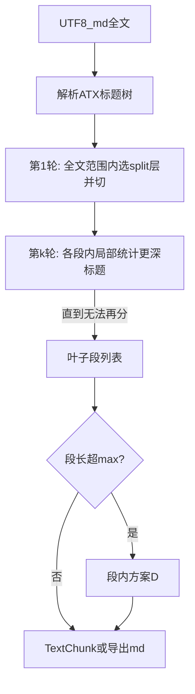

# v1.1.10 Markdown 标题层级递归预切分 + 方案 D 段内切分

| 属性 | 说明 |
| --- | --- |
| 文档版本 | v1.1.10（方案设计，待评审后实施） |
| 前置 | [v1.1.7-semantic-chunking-bcd-plan.md](v1.1.7-semantic-chunking-bcd-plan.md)（B/C/D 总览）、[v1.1.9-scheme-d-concrete.md](v1.1.9-scheme-d-concrete.md)（方案 D）、[v1.1.8-scheme-d-eval.md](v1.1.8-scheme-d-eval.md)（D 评测） |
| 关联代码（预期） | `src/chunking/` 新增或扩展模块；与 [`document_segmentation.py`](../src/chunking/document_segmentation.py)、[`ingest/loaders.py`](../src/ingest/loaders.py) 的衔接在 §7 说明 |

---

## 1. 目标与动机

**目标**：对 **Markdown 法规/文书** 切块时，先用 **ATX 标题层级** 做 **递归预切分**（粗→细，直到段内不再存在「可再分的多级标题结构」）；当某一预切分 **叶子段** 仍 **超过长度上限** 时，再 **仅在该段内** 调用 **方案 D**（文档分段模型 + 既有 min/max/换行优先再切分）。

**动机**：

- MinerU 等 md 中常见 **多级并存**（如多个 `#` 章 + 章内多个 `##` / `###`）。只做「全文一级最深多头」一次切分，章内仍可能过长；**在每一章内再按更深层级重复同一套规则**，可把检索单元稳定在「章—节—条」附近，减少 D 在无标题长段上乱切。
- 与「纯全文 D」相比：**硬边界尊重作者大纲**；与「只切一级」相比：**长章自动细分为多节**，再交给 D 处理超长节。

**非目标（本版可不实现）**：

- 不替代 BGE 检索向量；D 仍仅作段内细分。
- Setext 标题、条号正则（「第一条」非 `#`）可作为后续扩展，见 §6。

---

## 2. 流水线（概念）

- **阶段 A（递归标题预切分）**：产出 **叶子段** 列表；每段记录 **起始标题层级**、全文 `char` 区间、可选 **诊断链**（每轮选用的层级与理由）。
- **阶段 B（段内方案 D）**：条件同前：超 `DOC_SEGMENTATION_SECTION_MAX_CHARS`（或与 `DOC_SEGMENTATION_MAX_CHARS` 派生阈值一致）则对该子串跑 D，**坐标映射回全文**。

---

## 3. 标题层级多样性与扩展位

| 类型 | 表现 | 递归预切分下的行为要点 |
| --- | --- | --- |
| A | 多个 `#` 章 | 首轮常在 `#` 切块；章内若有多个 `##` 再第二轮切 |
| B | 单个 `#` 篇名 + 多个 `##` | 首轮若全局 `S` 只有二级满足「多头」，可能直接按 `##` 切；或首轮按 `#` 后第二轮按 `##`（取决于首轮全局 `max(S)`，见 §4） |
| C | 无一级、最深为 `###` 等 | 全文统计仍用同一套 `S`；首轮从实际出现的「最深多头」层开始 |
| D | `# 目录` 与 `# 第一章` 同级 | 与 v1.1.10 原案相同，可配 `skip_heading_regex` / 目录合并 |
| E | 代码块内 `#` | 解析应跳过 fenced code（首版可简化为仅行首 ATX） |

**策略枚举（Settings 示例）**：

- `CHUNK_MD_HEADING_STRATEGY`：`deepest_with_multiple`（默认）| `shallowest_with_multiple` | `fixed_level:n` | `none`。
- **`CHUNK_MD_HEADING_SINGLE_IMMEDIATE_CHILD`**（名称示例，布尔）：见 **§5.2**，控制「本级下 **恰好一个** 直接下一级标题」时是否还继续向更深层递归。

后续可插 `mineru_law_v1` 等插件策略，与通用 ATX 递归并列。

---

## 4. 第 1 轮：全文范围内的「最深且多头」层级

与初版一致，将「**最大的有多个的标题是几级**」落实为 **全文级** 统计（**注意：仅用于第 1 轮**）：

1. 解析全文 ATX 标题，得每条 `(level, char_offset)`。
2. 对每个 `L ∈ {1,…,6}`，记 `count_global(L)` = 全文中该层标题个数。
3. `S_global = { L | count_global(L) ≥ 2 }`。
4. 若 `S_global` 非空：`L_round1 = max(S_global)`，在 **L_round1** 上切出 **第一轮 section**（每个该层标题到下一 **同级或更浅** 标题前）。
5. 若 `S_global` 为空：按原 **回退 5a / 5b**（整段一节或 `sections = [全文]`），然后进入 **§5** 时各段内若仍无多头更深标题则直接结束标题阶段。

**说明**：`max(S_global)` 为 **数字最大 = 嵌套最深** 的多头层级；若希望首轮更「粗」，可改用 `shallowest_with_multiple` 即 `min(S_global)`。

---

## 5. 第 2 轮及以后：段内递归，直到无法再分

### 5.1 段内统计（必须与全文统计区分）

对每个当前 **section**（由某条「开启标题」界定，记其层级为 **`L_open`**，section 正文为从该标题行首到下一 **层级 ≤ L_open** 的标题行首之前）：

1. 在 **该 section 子串内**（可不含开启标题行本身，或含——实施时二选一并全文写死）扫描 ATX 标题。
2. 只考虑 **严格更深** 的标题：`level > L_open`。
3. 对每个满足 `L > L_open` 的层级，记 **`count_local(L)`** = **仅在本 section 内** 出现的该层标题个数。
4. `S_local = { L | L > L_open 且 count_local(L) ≥ 2 }`。
5. 若 `S_local` 为空：**本 section 不再细分**，成为 **叶子**。
6. 若 `S_local` 非空：令 **`L_split = max(S_local)`**（在「本段内多头」的层级中取 **最深**），按 **L_split** 将本 section 切成子 section；对每个子 section **递归**执行 §5.1。

**终止条件**：所有 section 均无法再产生非空的 `S_local`，或达到实现上的 **最大深度保护**（如最多递归 6 层，与 `#`…`######` 一致）。

### 5.2 「本级下只有一个下一级标题」——默认不切，可配置

**场景**：某 `#` 章下 **恰好只有一条** `##`（`count_local(L_open+1) == 1`），但更深层如 `###` 有多条。是否仍允许按 `###` 再分，易产生歧义。

**默认（推荐）**：**`CHUNK_MD_HEADING_SINGLE_IMMEDIATE_CHILD = strict`（或布尔 `skip_when_single_immediate_child=true`）**

- 若在本 section 内，**最浅的更深一级** `L_open + 1` **存在且** `count_local(L_open + 1) == 1`，则 **本 section 整体不再做标题递归细分**（直接作为叶子交给阶段 B）。  
- 语义：大纲上「章下仅一节」时不再硬拆成「章标题 + 单节标题」两块空壳，**减少无意义小块**；超长则交给 **D**。

**可选：`relaxed`（或 `skip_when_single_immediate_child=false`）**

- 忽略上述「单子级」早停，仍计算 `S_local`；若 `###` 多头仍可 `max(S_local)` 再切。适用于语料中「单条 `##` 占位但下面大量 `###`」且希望节级对齐的场景。

实施时二选一写进配置与单测。

### 5.3 与第 1 轮的关系

- 第 1 轮用 **全文** `count_global`；自第 2 轮起 **仅用** `count_local` 与当前 `L_open`，**禁止**再用全局计数替代段内计数，否则会出现「某章只有一个 `##` 却被全局 10 个 `##` 误导」的错误。

---

## 6. MinerU 目录、序言与条号

- **目录 / 序言**：同前版，可配 `skip_heading_regex`、`preamble_before_first_h1`。
- **条号非标题**：「第一条」非 `#` 时，递归标题阶段 **看不到**；仍可在后续版本加「条级」与标题链 **组合**，本方案不阻塞。

---

## 7. 与现有代码的衔接（实施时）

| 触点 | 建议 |
| --- | --- |
| 新模块 | 例如 `chunking/md_heading_presplit.py`：输出 **叶子 section 列表** + 每段 `L_open`、全文区间、**递归诊断树**（每轮 `S_local` / `L_split` / 是否触发单子级跳过）。 |
| 方案 D | 仅对超长 **叶子** 调 pipeline；偏移映射与 [`document_segmentation.py`](../src/chunking/document_segmentation.py) 复用。 |
| d04 / webui | 纯方案 D 导出 / 预览。 |
| **d05** | [`scripts/d05_heading_presplit_document_segmentation_export.py`](../scripts/d05_heading_presplit_document_segmentation_export.py)：标题预切分 + 段内 D，输出 ``data/chunk_md/d05_heading_presplit_document_segmentation/``。 |
| ingest | 评测通过后与 `CHUNK_DOC_SEGMENTATION_ENABLED` 等一致接入。 |

---

## 8. 效果评估（设计层结论）

| 维度 | 预期 |
| --- | --- |
| **块可解释性** | 优于纯 D：边界优先与 **大纲层级** 对齐，章/节标题落在块外的概率下降。 |
| **块长稳定性** | 优于「只切一轮最深多头」：长章内多级标题可被 **逐级** 拆开，减少单段过长、减少 D 在长无标题段上的「盲切」。 |
| **过切风险** | 通过 **§5.2 默认 strict 单子级不切** 抑制「一章仅一节仍被拆成两片」；若语料需要可改 relaxed。 |
| **与全文首轮 `max(S_global)` 的交互** | 若首轮即切在很深层（例如全局很多 `###`），可能 **跳过** 粗层章界；可配 `shallowest_with_multiple` 或「首轮强制不超过某 max level」作为产品开关（后续可加 `CHUNK_MD_HEADING_FIRST_ROUND_MAX_LEVEL`）。 |
| **算力** | 解析为线性扫描；递归轮数 ≤ 标题层数，开销可忽略；D 调用次数 ≈ **叶子段数**（超长才调），可能 **多于** 全文单次 D，需在 v1.1.8 类指标中记录 **infer 总时长**。 |

**结论**：在法规 md **确实存在多级 ATX 标题** 的前提下，本递归方案 **值得采纳**；默认 **strict 单子级不切** 与 **段内 local 计数** 为正确性的关键细节，须在实现与单测中固定。

---

## 9. 验收与风险

**验收（建议）**：

- 构造 fixture：`#` 多 + 某章内 `##` 多 / 某章仅单 `##` / 无更深标题；断言递归轮数与叶子边界。
- 离线对比：**纯 D** vs **单轮标题 + D** vs **递归标题 + D** 的章界跨越率、平均块长、D 调用次数与总耗时。

**风险**：

- 首轮 `max(S_global)` 与业务「先章后节」直觉不一致时，需依赖策略配置或 `first_round_max_level` 类扩展。
- 段内子串调 D 与全文调 D 的边界行为差异仍存在，见初版风险说明。

---

## 10. 小结

1. **第 1 轮**：全文 `deepest_with_multiple`（或策略枚举中的其它选项）得到第一轮 section。  
2. **第 2 轮起**：对每个 section **仅依据段内**、**level > L_open** 的标题计算 `S_local`，`L_split = max(S_local)` 再切，**递归至无法再分**。  
3. **§5.2**：默认 **单子级（直接下一级仅一条）不切**；提供 **strict / relaxed**（或等价布尔）配置。  
4. **阶段 B**：仅对超长 **叶子** 做方案 D。

本文通过评审后，可拆实施任务并回链更新 [v1.1.7-semantic-chunking-bcd-plan.md](v1.1.7-semantic-chunking-bcd-plan.md) 路线表。
