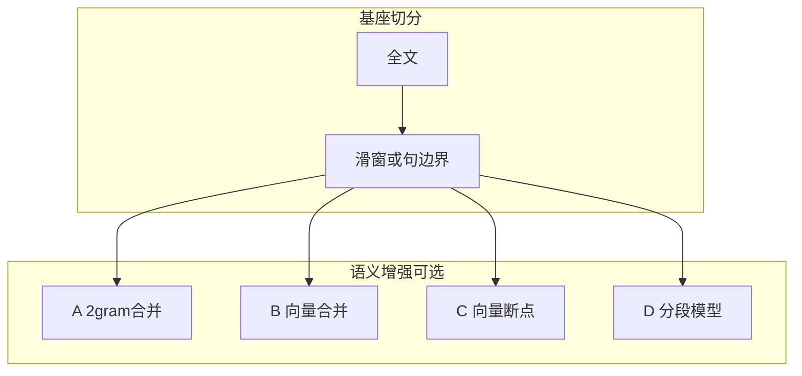

# v1.1.7 语义切分路线：方案 B / C / D 总览与方案 B 细化

| 属性 | 说明 |
| --- | --- |
| 文档版本 | v1.1.7（计划文档，实施状态见各节） |
| 前置 | [v1.1.6-semantic-chunking-plan.md](v1.1.6-semantic-chunking-plan.md)（方案 A：2-gram 相邻合并，已实施） |
| 关联代码 | [`src/chunking/split.py`](../../src/chunking/split.py)、[`src/ingest/loaders.py`](../../src/ingest/loaders.py)、[`src/embeddings/`](../../src/embeddings/)、[`src/conf/settings.py`](../../src/conf/settings.py) |
| **路线状态** | **方案 C**：已提供离线导出脚本（`scripts/c03_breakpoint_export.py` → `data/chunk_md/c03_breakpoint/`），**未**进主入库链。**方案 D** 仍暂不推进；入库主线见 [v1.0.4-ingest-plan.md §12](v1.0.4-ingest-plan.md)。 |

---

## 1. 路线总览：A 与 B / C / D

| 代号 | 名称 | 核心做法 | 与检索向量空间 | 典型成本 |
| --- | --- | --- | --- | --- |
| **A** | 轻量相邻合并（已实施） | 滑窗/句边界 → `semantic_merge_chunks`，相似度为 **字符 2-gram 余弦** | 无关 | 低（无模型） |
| **B** | 向量相邻合并（本文件细化） | 仍只在 **合并阶段** 换相似度：**BGE 等稠密向量余弦** 替代 2-gram | **与入库/检索一致（BGE-M3）** | 中（每块至少编码一次，可批处理） |
| **C** | 嵌入驱动断点 | 在句/窗序列上算 embedding，**低相似处**作为语义切分点，再施加长度约束 | 与检索一致（若用 BGE） | 中高（编码次数通常多于 B） |
| **D** | 文档分段专用模型 | 使用 `DOCUMENT_SEGMENTATION_PATH` 等 **分段分类/序列标注模型** 预测边界，再组块 | **与 BGE 不一致**（另一套表示） | 中（多一套推理栈；调参维度不同） |

关系示意（均在「滑窗/句边界」之后或与之组合，**不替代**法规结构规则的可选前置）：

**选型提示（摘要）**

- **B**：升级成本最低，优先验证「与检索同空间」是否带来更好块边界与召回。
- **C**：解决的是「**切在哪**」，比 B 更接近完整语义切分，但调参与算力更高。
- **D**：边界由专用模型决定；是否优于 C **取决于模型与法律 md 语料的匹配度**，需 A/B 评测，不能先验认定 D 优于 C。

---

## 2. 方案 C（嵌入驱动断点）— 记录级说明

> **状态：实验性落地（离线导出）。** 已实现嵌入相邻窗断点 + 最小/最大块长后处理，脚本写出 `data/chunk_md/c03_breakpoint/`（块间极醒目分隔），**未**接入 `load_chunks` / ES 主链路；评测与排期仍后移。

**目标**：在候选粒度（句、固定字窗、或「条」内子窗）上，用 **相邻窗向量相似度** 找语义转折，再合并/截断为满足 `min/max` 的 `TextChunk`。

**要点**

- 候选生成：可与现有 [`iter_text_slices_boundary_aware`](../../src/chunking/boundary.py) 或按 `\n`、句号等先切 **细粒度单元**，再滑动拼接。
- 相似度：建议使用 **与入库相同的 BGE**（[`build_embedder`](../../src/embeddings/__init__.py)），保证与 ES 检索一致。
- 断点规则（示例）：`sim(i, i+1) < T` 或 `sim(i, i+1) < sim(i-1, i) - margin`；再与 **最大块长、最小块长、重叠** 联合约束。
- **风险**：窗长/步长敏感；长文档编码次数多。建议仅在 **条/章内部** 或 **超长条** 上启用以降低次数。

**验收**：与方案 A/B 共用同一套文档（如 [tests/…/fixtures/宪法.md](../../tests/test_chunking/fixtures/宪法.md) 与 [宪法_c03_breakpoint_golden.json](../../tests/test_chunking/fixtures/宪法_c03_breakpoint_golden.json)）做块数、条完整性、抽样问答对比。

---

## 3. 方案 D（`DOCUMENT_SEGMENTATION_PATH` 分段模型）— 记录级说明

> **状态：暂停。** 本节保留设计备忘；与方案 C 一并后移排期。

**目标**：使用已配置路径下的 **中文文档分段** 类模型（如 BERT-based document segmentation），输出「是否应在句间断开」或段落边界，再与最大长度等组合为块。

**要点**

- 仓库 [`.env`](../../.env) 中已有 `DOCUMENT_SEGMENTATION_PATH`，[v1.1.6](v1.1.6-semantic-chunking-plan.md) 已说明 **尚未接入主链路**；实施需独立 **transformers/onnx** 推理封装，与 BGE **分开加载**。
- **优势**：针对篇章边界任务训练，主观「分段自然度」可能更好。
- **劣势**：与检索向量 **不同空间**；需单独监控延迟与显存。

**验收**：离线对比 C（同语料、同评测脚本）；在线抽样检索质量。  
**评测清单（推进 D 时使用）**：[v1.1.8-scheme-d-eval.md](v1.1.8-scheme-d-eval.md)。**方案 D 具体实施**：[v1.1.9-scheme-d-concrete.md](v1.1.9-scheme-d-concrete.md)。

---

## 4. 方案 B 细化：用 BGE 余弦替代 2-gram 的相邻合并

### 4.1 目标与边界

- **不改变** 现有主流程顺序：**先** `iter_text_slices` / `iter_text_slices_boundary_aware` 得到块列表，**再** 做相邻合并（与 `semantic_merge_chunks` 一致）。
- **仅替换** 相邻两块是否合并的 **相似度定义**：由 `_char_ngrams` + `_cosine_sim_counter` 改为 **BGE 向量余弦相似度**（或可选后端切换）。
- **保持** `min_chunk_chars` / `max_chunk_chars` / `similarity_threshold` 的 **语义**（短块优先合并、合并后不超长、超过阈值才合并），但 **阈值数值** 可能与 2-gram 不可直接复用，需 **单独标定**（见 4.5）。

### 4.2 配置设计（建议）

在 [`Settings`](../../src/conf/settings.py) 中新增（命名可微调）：

| 变量 | 含义 | 建议默认 |
| --- | --- | --- |
| `CHUNK_SEMANTIC_MERGE_SIMILARITY` | `char_ngram`（现状）\| `embedding`（方案 B） | `char_ngram` |
| 沿用 | `CHUNK_SEMANTIC_MERGE_THRESHOLD` 等 | 与 A 相同字段名；embedding 模式下建议另建推荐默认值或通过文档说明需重标定 |

说明：**不**默认改为 `embedding`，避免升级部署时行为突变。

### 4.3 实现结构（建议）

1. **抽象相似度接口**（概念上）  
   - `sim(a: TextChunk, b: TextChunk) -> float`  
   - 实现 A：`现有 2-gram`  
   - 实现 B：对 `a.text`、`b.text`（或合并候选串）用 **批量编码** 后算余弦。

2. **批量编码策略（重要）**  
   - 合并是 **顺序决策**（合并后 `current` 变长，下一块与谁比可能变化）。  
   - **朴素实现**：每步只对 `(current, next)` 编码 2 条文本，调用次数多。  
   - **推荐实现 v1**：第一轮对 **初始** 所有 `chunks[i].text` **批量 `embed_query` 或 `embed_documents`**（视 [`EmbeddingBackend`](../../src/embeddings/base.py) API）得到 `V[i]`；比较相邻时用 `V[i]` 与 `V[i+1]` 的余弦。当 `current` 与 `next` **合并** 后，对 **新 current 文本** 再编码一次（或仅对合并段重算），继续与下一初始块向量比较——直至稳定实现「线性扫描 + 按需补编码」。  
   - **推荐实现 v2（减少重编码）**：仅在「当前块长度仍 `< min_chunk_chars` 且准备与下一块合并判断」时，对 **拼接串** `current + joiner + next` 与 `current`、`next` 的向量关系做近似；若过于复杂，v1 先上线。

3. **调用链**  
   - **入库**：[`loaders.py`](../../src/ingest/loaders.py) 在已有 `build_embedder(settings)` 或等价位置 **构造 embedder 一次**，传入 `iter_chunks_for_text(..., merge_similarity=...)` 或包装函数。  
   - **纯切分 API**：[`iter_chunks_for_text`](../../src/chunking/split.py) 增加可选参数 `embedding_backend: EmbeddingBackend | None = None`；当 `CHUNK_SEMANTIC_MERGE_SIMILARITY=embedding` 且未注入 backend 时 **降级**为 `char_ngram` 并打 **warning**，或 **显式失败**（二选一，建议在计划中采用 **显式失败** 以免静默偏差）。

4. **Chunking WebUI**  
   - [`chunking/webui/app.py`](../../src/chunking/webui/app.py) 预览默认可不加载 BGE（避免重依赖）；选项：  
     - 仅支持 2-gram 预览；或  
     - 可选「向量合并」勾选时 **懒加载** embedder（与 QA 一致需本地模型路径）。  
   - 文档与 UI 文案需标明 **预览与 ingest 可能不一致**。

### 4.4 观测与日志

- 延续 `chunk_semantic_merge_done` 事件，增加字段：`similarity_backend: char_ngram | embedding`、`embedding_batch_size`（若适用）。  
- 可选：记录 **相邻对** 相似度分布的采样（仅 debug 级别），便于阈值标定。

### 4.5 阈值与评测

- **不要**假设 2-gram 的 `0.82` 等于 BGE 余弦的 `0.82`。建议在固定语料（如 `data/宪法.md`）上扫描 **合并率 ~ 方案 A 同量级** 或按检索指标选点。  
- 离线：块数、`merge_ratio`、条/款完整性统计（与 [doc/chunk/](../chunk/) 现有报告方式对齐）。  
- 在线：抽样 query 的 hit 质量与答案连贯性。

### 4.6 测试与交付清单

- 单元测试：`embedding` 模式下 **高相似** 相邻块合并、**低相似** 不合并；mock `EmbeddingBackend` 固定向量。  
- 集成测试（可选）：标记 `@pytest.mark.slow` 的真实 BGE 路径。  
- 更新 [`.env.example`](../../.env.example) 与本文状态为「方案 B 已实施」后，在 v1.1.6 文档中增加 **参见 v1.1.7** 链接。

**已落地（方案 B）**

- 配置：`CHUNK_SEMANTIC_MERGE_SIMILARITY` = `char_ngram` \| `embedding`（[`Settings.chunk_semantic_merge_similarity`](../../src/conf/settings.py)）。  
- 合并：[`semantic_merge_chunks`](../../src/chunking/split.py) 支持 `similarity_backend`；`embedding` 时对初始块批量编码，合并后单条重编码。  
- 入库：[`scripts/rag_ingest.py`](../../scripts/rag_ingest.py) 在启用 `embedding` 时于切分前 `build_embedder`，并与入库向量复用同一实例。  
- 预览：Chunking WebUI 仍默认 **char_ngram**（不传 embedder），与重模型 ingest 解耦。

---

## 5. 实施顺序建议（与本文档的关系）

1. **方案 B**（本文 §4）：已落地；后续仅做阈值/观测微调。  
2. **方案 C / D**：**暂停**，恢复前需单独开议题（算力、评测集、与 OSS 入库节奏对齐）。  
3. **入库数据来源**：当前以 **阿里云 OSS → 本地 → 与 `rag_ingest` 同链路写入 ES** 为主，见 [v1.0.4-ingest-plan.md §12](v1.0.4-ingest-plan.md)。

---

## 6. 文档状态

| 章节 | 状态 |
| --- | --- |
| §1–§3 B/C/D 总览 | 已记录 |
| §4 方案 B 细化 | 已记录；**方案 B 代码已实施**（见 §4.6「已落地」） |
| §2 方案 C | **实验导出**（[`scripts/c03_breakpoint_export.py`](../../scripts/c03_breakpoint_export.py)、[`chunking/breakpoint_embed.py`](../../src/chunking/breakpoint_embed.py)）；主链路未接 |
| §3 方案 D | **暂停**（仅设计备忘，未编码、当前不排期）；评测见 [v1.1.8-scheme-d-eval.md](v1.1.8-scheme-d-eval.md)，实施方案见 [v1.1.9-scheme-d-concrete.md](v1.1.9-scheme-d-concrete.md) |
| Chunking WebUI 向量合并预览 | 未做（保持 char_ngram） |
