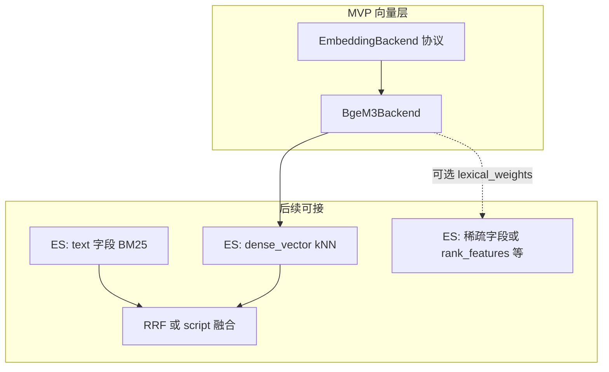

# BGE-M3 向量层实现计划

| 属性 | 说明 |
| --- | --- |
| 文档位置 | `doc/text2vector/BGE-M3 向量层实现计划.md` |
| 关联计划 | [v1.0.0-rag-law-mvp-plan.md](../plan/v1.0.0-rag-law-mvp-plan.md) 第 9 节「向量」项 |
| 状态 | 向量层已实现（`src/embeddings`）；ES 写入与检索待后续 |

---

## 1. 背景与目标

在现有 **配置层**（[`src/conf/settings.py`](../../src/conf/settings.py)）与 **切分**（[`src/chunking/`](../../src/chunking/)）之上，新增**向量模块**：

- 从本地路径加载 **BGE-M3**（`BGE_M3_PATH`，已在配置中）。
- 封装 LangChain 风格的 **`embed_documents` / `embed_query`**，供入库与在线检索共用。
- 向量数值与后续 Elasticsearch **`dense_vector` 的 `similarity` 约定一致**（见下文 L2 + cosine）。

当前 [`pyproject.toml`](../../pyproject.toml) 尚未声明 `torch` / FlagEmbedding 等依赖；本任务**新增包与可选依赖**，不改动切分核心逻辑。

---

## 2. 设计要点（与 ES 一致）

### 2.1 相似度约定

- MVP 索引设计为 `dense_vector`，`similarity: "cosine"`（见 MVP 计划第 6 节）。
- **入库向量与查询向量必须在同一几何语义下可比较**：对 BGE-M3 的 **dense 输出做 L2 归一化**后再写入 ES、再用于 `knn`。
- 即使底层库默认已归一化，仍在应用代码中**显式 normalize**，作为单一事实来源，减少版本与实现差异带来的漂移。

### 2.2 查询与文档不对称编码

- BGE 系在检索场景常对 **query** 与 **passage** 使用不同前缀或 `encode` 参数（FlagEmbedding 的 `BGEM3FlagModel` 支持按用途区分）。
- **`embed_query` 与 `embed_documents` 应分路实现**，共用同一模型实例，但分别走「查询侧」与「文档侧」编码路径；具体参数以 [FlagEmbedding](https://github.com/FlagOpen/FlagEmbedding) 官方 README / 示例为准。

### 2.3 向量维度

- BGE-M3 dense 常见为 **1024** 维。
- **以首次成功 `encode` 得到的向量长度为准**（如暴露 `dense_dimension` 属性），供后续 `indices.create` 写 `dims`；避免与真实模型不一致的硬编码。

---

## 3. 扩展性（BM25 混合 / 稠密+稀疏）

| 扩展 | 向量层职责 | 说明 |
| --- | --- | --- |
| **BM25 + 向量混合** | 基本不变 | 混合在 **ES 查询 DSL** 完成（例如 `knn` + `match` + [RRF](https://www.elastic.co/guide/en/elasticsearch/reference/current/rrf.html)）。索引中同时保留 **`text` 与 `embedding`** 即可；向量层仍只负责 query 的 dense。 |
| **BGE-M3 稠密 + 稀疏** | 扩展返回类型 | FlagEmbedding 对 M3 可同时给出 dense 与 lexical（稀疏）权重。MVP 仅序列化 dense；预留 **`EmbeddingVector` 数据类**（`dense` 必填，`sparse` 可选，结构可与 ES 稀疏字段对齐）或 `embed_*_full()` 类接口，避免日后大面积改函数签名。 |

**原则**：加权融合、RRF、rerank 等**检索策略不进入 embedding 模块**，由未来的 `retrieval/` 或 `es_store` 编排；embedding 只负责「模型 → 向量列表 + 归一化约定」。

---

## 4. 建议目录与 API

| 路径 | 职责 |
| --- | --- |
| `src/embeddings/base.py` | `EmbeddingBackend`（`Protocol` 或 ABC）：`embed_documents(texts) -> list[list[float]]`，`embed_query(text) -> list[float]`；可选 `dense_dimension`。 |
| `src/embeddings/bge_m3.py` | `BgeM3EmbeddingBackend`：用 `BGE_M3_PATH` 加载 `BGEM3FlagModel`（或经评估的等价方式），批大小用 `embedding_batch_size`，归一化建议用 `numpy` 或 `torch`（与依赖取舍一致）。 |
| `src/embeddings/__init__.py` | 导出上述类型；可提供 `build_embedder(settings) -> EmbeddingBackend` 工厂，便于测试注入 stub。 |

**依赖**：在 `pyproject.toml` 增加可选 extra（例如 `embedding = ["torch", "FlagEmbedding", "numpy"]`，包名以 PyPI 为准），使未装向量环境时仍可仅使用 `conf` / `chunking`。

**配置**：复用 `BGE_M3_PATH`、`EMBEDDING_BATCH_SIZE`。若需与 ES mapping 共用同一枚举，可增加 **`VECTOR_SIMILARITY`**（默认 `cosine`），由索引创建与文档共同引用。

**安装提示**：在 [`README.md`](../../README.md) 或 [`.env.example`](../../.env.example) 中说明：`pip install -e ".[embedding]"`（或等价 uv 命令）。

---

## 5. 测试策略

- **单元测试**：不依赖本地模型目录；对 stub/fake 实现断言批长度、维度、`embed_query` / `embed_documents` 形状及 L2 范数约为 1。
- **集成测试（可选）**：`pytest.mark.integration` 或仅在设置 `BGE_M3_PATH` 且模型存在时运行；小批量真实编码，检查维度与相同文本向量余弦自洽性。

必要时扩展 `pyproject.toml` 中 coverage 的 `include`，纳入 `embeddings` 包。

---

## 6. 与后续任务的衔接

| 本任务交付 | 下一任务（ES） |
| --- | --- |
| 可导入的 embedder、`dense_dimension`、**L2 + cosine** 约定说明 | `indices.create` 中 `embedding.dims`、`similarity` 与本模块一致；`bulk` / `search` 使用同一向量格式 |

若后续增加稀疏向量字段：仅在 ES mapping 与 bulk 中增列，并在 `EmbeddingVector` 或并行 API 中填充 `sparse` 即可。

---

## 7. 实施任务清单

- [x] `pyproject.toml`：增加 `embedding` 可选依赖与说明。
- [x] 实现 `src/embeddings`：`EmbeddingBackend`、`BgeM3EmbeddingBackend`、L2 归一化、query/document 分路编码（`encode_queries` / `encode_corpus`）。
- [x] 预留 `EmbeddingVector`（dense + 可选 sparse）与 `build_embedder(settings)`。
- [x] 测试：`tests/test_embeddings` stub 单测 + 可选集成（`RUN_BGE_M3_INTEGRATION=1`）。
- [x] `.env.example`（及 `README`）：`VECTOR_SIMILARITY`、安装 extras 提示。
- [x] MVP 计划 [v1.0.0-rag-law-mvp-plan.md](../plan/v1.0.0-rag-law-mvp-plan.md) 中「向量」项已勾选（归一化与 ES `dense_vector` 的 cosine 一致）。

---

## 8. 版本记录

| 版本 | 日期 | 说明 |
| --- | --- | --- |
| v0.1 | 2026-04-05 | 从 Cursor 计划整理入库，含扩展性说明与任务清单 |
